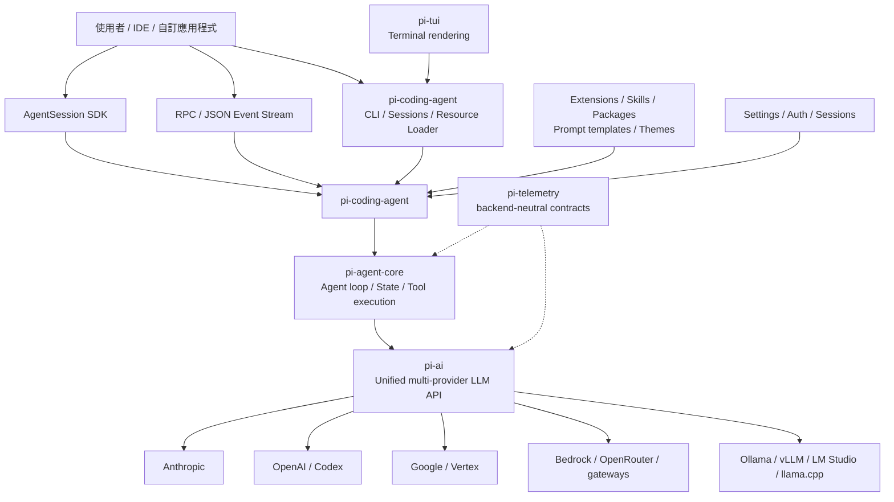

# Pi 深度介紹

<!-- Generated by chatgpt-export-markdown v1.3.0 -->

_**User (2026-08-12 09:18:08Z)**_

幫我深度介紹 Pi 以及它的各種用法 @Deep research 
https\://github.com/earendil-works/pi
[https://pi.dev/](https://pi.dev/)
[https://pi.dev/docs/latest](https://pi.dev/docs/latest)

---

_**Assistant (2026-08-12 09:23:20Z)**_

# Pi 深度研究報告：極簡、可嵌入、可自我擴充的 Coding Agent Harness

## 執行摘要

截至 **2026 年 8 月 12 日**，Pi（[官方網站](https://pi.dev/)；[GitHub](https://github.com/earendil-works/pi)；[最新版文件](https://pi.dev/docs/latest)）最準確的定位不是「另一個功能齊全的 Claude Code / Codex 替代品」，而是**一套刻意保持核心極小、讓使用者自行組裝工作流的 coding-agent harness 與 TypeScript agent toolkit**。官方甚至明確把「沒有內建 MCP、sub-agents、permission popups、plan mode、to-do、background bash」列為設計原則；這些能力應由 extension、skill、package、容器或 tmux 等外部機制提供。這使 Pi 和多數競品採取近乎相反的產品哲學。([pi.dev](https://pi.dev/docs/latest?utm_source=chatgpt.com))

Pi 並非單一 CLI。核心 monorepo 包含 `pi-coding-agent`、`pi-agent-core`、`pi-ai`、`pi-tui`、`pi-telemetry` 等層次：最底層的 `pi-ai` 統一多家 LLM provider；`pi-agent-core` 提供有狀態的 agent loop、tool calling 與事件流；`pi-coding-agent` 再組合成完整 CLI、session、resource loader 與可嵌入 SDK；`pi-tui` 則提供差異化渲染的終端 UI。這種分層讓 Pi 同時適合「每天在 terminal 寫程式」與「拿 agent runtime 當 library 嵌入自己的產品」。([github.com](https://github.com/earendil-works/pi/blob/main/packages/ai))

專案由 **Mario Zechner** 原創；作者至少在 2025 年 11 月已公開撰文解釋 Pi 的架構。2026 年春季 Mario 加入 Earendil，Pi 的 stewardship 隨之轉到 **Earendil Works / Earendil Inc.**；2026 年 5 月程式庫與 npm scope 正式遷至 `earendil-works/pi`、`@earendil-works/*`。Earendil 的 RFC 明確承諾 **Pi core 維持 MIT 授權**，但未來圍繞 Pi 的某些增值產品可能採 Fair Source 或 proprietary 模式。([mariozechner.at](https://mariozechner.at/posts/2025-11-30-pi-coding-agent/?utm_source=chatgpt.com))

目前最新標記版為 **v0.84.1，發布於 2026 年 8 月 7 日**；該版加入 Qwen Token Plan Individual、`pi auth check`、fullscreen 操作改進與 extension tool-call termination 等能力。GitHub 在 8 月 12 日抓取時顯示，v0.84.1 之後 `main` 已再累積 109 commits；再結合 7 月 21 日的 0.81.0、7 月 24 日的 0.82.0、8 月 6 日的 0.84.0，可判斷專案目前處於**極高迭代速度、尚未 1.0 的快速演化階段**，而不是適合假設 API 已完全凍結的成熟 LTS 平台。([github.com](https://github.com/earendil-works/pi/releases/latest))

Pi 最突出的技術優勢是：

| 面向 | 判斷 |
|---|---|
| 可擴充性 | **非常強**：extension 可以攔截生命週期事件、增加/封鎖 tools、commands、自訂 UI、compaction、provider 等。([pi.dev](https://pi.dev/docs/latest/extensions?utm_source=chatgpt.com)) |
| 多模型 | **非常廣**：官方 `pi-ai` 已直接支援大量商業、雲端、gateway 與 local/OpenAI-compatible providers。([github.com](https://github.com/earendil-works/pi/blob/main/packages/ai)) |
| 嵌入能力 | **非常強**：Node/TS 可直接用 SDK；其他語言可走 JSONL RPC；另有 JSON event stream。([pi.dev](https://pi.dev/docs/latest/sdk)) |
| CLI/TUI | 成熟度快速提升；0.84 加入 fullscreen、Mermaid、LaTeX，0.84.1 又強化 mouse/selection。([pi.dev](https://pi.dev/news/releases/0.84.0?utm_source=chatgpt.com)) |
| 安全預設 | **刻意偏低階 primitive**：沒有內建 sandbox 或一般 permission system；工具與 extensions 預設擁有 Pi process 的 OS 權限。需要自行用 container/VM/policy sandbox 建立邊界。([pi.dev](https://pi.dev/docs/latest/security)) |
| 效能證據 | 架構上有不少效率設計，但**未找到官方、當代、可與 Codex/Claude Code 做 apples-to-apples 比較的 coding benchmark**；官方 Discussion 中也有人直接詢問此缺口。([github.com](https://github.com/earendil-works/pi/discussions/1637?utm_source=chatgpt.com)) |
| 生產使用 | Earendil 明確表示自己的產品「建立在 Pi 上，也用 Pi 開發」；但未找到官方整理的外部企業客戶 case-study corpus，因此企業採用規模屬**未指定**。([rfc.earendil.com](https://rfc.earendil.com/0015/?utm_source=chatgpt.com)) |

**整體判斷：**若需求是「希望 agent harness 本身成為可程式化基礎設施，而且願意自行決定 permission、sandbox、MCP/subagent orchestration 與 workflow」，Pi 是目前非常有吸引力的選擇。反之，若需求是開箱即用的企業 permission model、MCP、plan/subagent 等完整 opinionated UX，Claude Code、Codex 或 OpenCode 現階段通常需要較少自行組裝。這不是 Pi 的功能缺失偶然造成的，而是其刻意選擇的 abstraction boundary。([pi.dev](https://pi.dev/docs/latest/usage?utm_source=chatgpt.com))


## 專案定位、沿革、治理與授權

Pi 的官方描述是 **“minimal terminal coding harness”**：核心盡量保持小，把工作流專屬能力推到 TypeScript extensions、Agent Skills、prompt templates、themes 與 Pi packages。預設 agent 擁有 `read`、`write`、`edit`、`bash` 四個主要工具，另可啟用 `grep`、`find`、`ls` 等 read-only tools。Session 自動保存，支援 tree navigation、fork/clone、context compaction、模型切換與 reasoning level。([pi.dev](https://pi.dev/docs/latest?utm_source=chatgpt.com))

這裡的「minimal」值得特別理解。Pi 並非功能很少，而是**將功能移到 extension boundary**。官方列出的可自行實作案例包括 permission gate、git checkpointing、敏感路徑保護、自訂 compaction、conversation summaries、interactive wizard、stateful tools、webhook/CI integrations 等。也就是說，Pi 的產品哲學比較接近「Emacs/Neovim 式 programmable core」而不是「所有 workflow 都由 core team 定義」。([pi.dev](https://pi.dev/docs/latest/extensions?utm_source=chatgpt.com))

**沿革方面**，原作者 Mario Zechner 在 2025 年 11 月 30 日的原始文章中已介紹 Pi 的四層構件 `pi-ai`、`pi-agent-core`、`pi-tui`、`pi-coding-agent`；因此可以確定 Pi 至少在 2025 年下半年已公開存在，但官方資料中沒有一個明確宣告「project started on YYYY-MM-DD」的權威日期，**精確創始日應視為未指定**。([mariozechner.at](https://mariozechner.at/posts/2025-11-30-pi-coding-agent/?utm_source=chatgpt.com))

2026 年 3 月 30 日 Earendil RFC 已公開表示 Mario 即將加入 Earendil、公司取得 Pi；Mario 4 月的個人文章亦確認加入 Earendil並帶著 Pi 一同前往。到 2026 年 5 月 7 日，官方宣布 repository 從舊位置遷到 `earendil-works/pi`，npm scope 從 `@mariozechner/*` 改成 `@earendil-works/*`：**v0.74.0 是新 scope 的第一版，v0.73.1 是舊 scope 最後一版**；既有 settings 與 sessions 不需要搬遷。([rfc.earendil.com](https://rfc.earendil.com/0015/?utm_source=chatgpt.com))

治理上，目前最準確的說法是：**Earendil Works 是專案 steward，Mario Zechner 是 creator 且仍是 package metadata 中的 author。** GitHub release notes 顯示大量外部 contributor 持續參與，不過官方沒有發布一份穩定、完整、具角色定義的「current maintainers roster」，因此不宜自行推定所有具有 commit/review 權的人員名單。Repo 同時說明，新 contributor 的 issue/PR 可能預設自動關閉，由 maintainers 每日審閱，這是目前較特殊的 contribution policy。([github.com](https://github.com/earendil-works/pi/blob/main/packages/coding-agent/package.json))

授權則相當清楚：repository 與文件目前均為 **MIT License**。更重要的是 Earendil 的 [RFC 0015](https://rfc.earendil.com/0015/) 不只描述現況，而是公開承諾「core is MIT」且不打算改變；不過 Earendil 同時保留未來提供 Fair Source 增值元件與 proprietary/cloud-only 服務的可能性。因此，對企業架構設計而言應把「Pi core 的 MIT 承諾」和「未來 Earendil 整體產品線必然全部 MIT」區分開。後者並沒有被承諾。([rfc.earendil.com](https://rfc.earendil.com/0015/?utm_source=chatgpt.com))

截至目前 GitHub 頁面顯示約 **88k stars、10.9k forks**，最新 release v0.84.1；這些數字只能當社群規模的瞬時指標，不能等同 production maturity。更重要的成熟度訊號是它仍是 `0.x`、API 與 install architecture 持續快速改動。([github.com](https://github.com/earendil-works/pi))


## 架構、核心元件、平台與安裝方式

Pi 的架構可以理解成一條由「模型 transport」逐層堆疊到「完整 coding UX」的鏈：



這張圖是依官方 package boundaries、SDK 與 provider 文件整理，而非官方固定 UML。([github.com](https://github.com/earendil-works/pi/blob/main/packages/ai))

**`@earendil-works/pi-ai`** 是最底層的 unified LLM API。它統一 provider/model/auth、streaming、usage/cost、context handoff 等能力，而且只將支援 tool calling 的 model 納入主要 agent 使用範圍。Provider 自己掌握 model catalog、authentication 與 stream implementation，而共享 wire protocol 支援 Anthropic Messages、OpenAI Responses、OpenAI-compatible completions 等模式。各 provider factory 可以獨立 import，SDK implementation 延後到首次請求才載入，以降低不必要的 bundle/load 成本。([github.com](https://github.com/earendil-works/pi/blob/main/packages/ai))

官方 provider catalog 很廣，包括 OpenAI、OpenAI Codex OAuth、Anthropic、Google/Gemini、Vertex、Azure OpenAI、DeepSeek、Mistral、Groq、Cerebras、xAI、OpenRouter、Vercel AI Gateway、Amazon Bedrock、Cloudflare、Together、Hugging Face、Moonshot/Kimi、Qwen、GitHub Copilot 等，也能透過 OpenAI-compatible endpoint 連接 Ollama、vLLM、LM Studio 等本地服務；0.81.0 又加入 built-in llama.cpp router。實際 catalog 會演進，因此應以 [Providers](https://pi.dev/docs/latest/providers) 與 Pi model catalog 為準。([github.com](https://github.com/earendil-works/pi/blob/main/packages/ai))

**`pi-agent-core`** 再加入 stateful agent、tool execution 與 event streaming；**`pi-coding-agent`** 則把它包裝成完整 coding application，包括 built-in file/bash tools、session manager、resource loader、compaction、CLI、SDK、RPC 等。`pi-tui` 採 differential rendering 與 synchronized terminal output；主畫面模式保留 terminal scrollback，新 fullscreen 模式則讓 application 自己管理 viewport。([github.com](https://github.com/earendil-works/pi/blob/main/packages/agent))

**`pi-telemetry`** 刻意只定義 vendor-neutral callback/contracts，不綁特定 exporter 或 global span state，這讓 embedding 應用能自行決定 observability backend。另有獨立的 **Pi Chat** 專案，把 Discord/Telegram channel 對應到 sandboxed Pi sessions；其官方設計是在 Gondolin VM 中執行 channel session/tools。([github.com](https://github.com/earendil-works/pi/blob/main/packages/telemetry))

### 平台與語言

Pi 主體以 **TypeScript/ESM** 開發，npm `pi-coding-agent` 目前要求 **Node.js ≥ 22.19.0**。第一級程式化 SDK 因此也是 JavaScript/TypeScript。其他語言沒有官方等價的 native SDK，但 RPC 是 strict JSONL over stdin/stdout，因此任何能啟動 subprocess 並處理 JSON 的語言都能可靠整合。官方 RPC 文件甚至包含 Python client 範例。([github.com](https://github.com/earendil-works/pi/blob/main/packages/coding-agent/package.json))

Standalone binaries 的 GitHub release workflow 涵蓋 **macOS arm64/x64、Linux arm64/x64、Windows arm64/x64**；Android 則有官方 **Termux** setup。Windows 原生使用時仍需要 Bash，官方會尋找自訂 shell path、Git Bash 或 PATH 中的 `bash.exe`；Git for Windows 通常即可提供必要 Bash。([github.com](https://github.com/earendil-works/pi/blob/main/.github/workflows/build-binaries.yml?utm_source=chatgpt.com))

### 安裝選項

| 方法 | 典型命令/用途 | 評估 |
|---|---|---|
| npm，全域 | `npm install -g --ignore-scripts @earendil-works/pi-coding-agent` | 官方最明確、最一般的方式；需 Node ≥ 22.19。([pi.dev](https://pi.dev/docs/latest/quickstart?utm_source=chatgpt.com)) |
| 官方 curl installer | `curl -fsSL https://pi.dev/install.sh \| sh` | Linux/macOS 官方支援；**目前文件仍表示此 installer 最終使用 global npm install**。([pi.dev](https://pi.dev/docs/latest?utm_source=chatgpt.com)) |
| PowerShell installer | `powershell -c "irm https://pi.dev/install.ps1 \| iex"` | 官網提供的 Windows convenience path。([pi.dev](https://pi.dev/?utm_source=chatgpt.com)) |
| pnpm | `pnpm add -g --ignore-scripts @earendil-works/pi-coding-agent` | 官網提供。([pi.dev](https://pi.dev/?utm_source=chatgpt.com)) |
| Bun | `bun add -g --ignore-scripts @earendil-works/pi-coding-agent` | 官網提供。([pi.dev](https://pi.dev/?utm_source=chatgpt.com)) |
| Standalone binary | 從 GitHub Releases 下載對應平台 asset | 不需把 npm global install 當 runtime；release assets 有多平台 binaries。([github.com](https://github.com/earendil-works/pi/blob/main/.github/workflows/build-binaries.yml?utm_source=chatgpt.com)) |
| 原始碼 | clone repo、`npm install --ignore-scripts`、`npm run build` | 適合開發 Pi 本身或 fork。([github.com](https://github.com/earendil-works/pi)) |
| Docker | 官方 Dockerfile 範例 | 適合建立完整 process isolation。([pi.dev](https://pi.dev/docs/latest/containerization?utm_source=chatgpt.com)) |

官方刻意使用 `--ignore-scripts`，因正常 Pi 安裝本身不需 dependency lifecycle scripts；這同時降低 package-install supply-chain attack surface。([pi.dev](https://pi.dev/docs/latest/quickstart?utm_source=chatgpt.com))

最簡單的安裝與登入流程：

```bash
npm install -g --ignore-scripts @earendil-works/pi-coding-agent

cd /path/to/project
pi

# 在互動介面：
/login
```

或直接使用 API key：

```bash
export ANTHROPIC_API_KEY="..."
pi
```

目前 `/login` 可處理包含 ChatGPT Plus/Pro（Codex）、Claude Pro/Max、GitHub Copilot、OpenRouter 等 subscription/OAuth 路徑；credentials 保存至 `~/.pi/agent/auth.json` 並在適用時自動 refresh。v0.84.1 又加入 `pi auth check` 供 provider/model credential preflight。([pi.dev](https://pi.dev/docs/latest/providers?utm_source=chatgpt.com))

Docker 的官方基本模式非常直接：

```dockerfile
FROM node:24-bookworm-slim

RUN apt-get update \
 && apt-get install -y --no-install-recommends bash ca-certificates git ripgrep \
 && rm -rf /var/lib/apt/lists/*

RUN npm install -g --ignore-scripts @earendil-works/pi-coding-agent

WORKDIR /workspace
ENTRYPOINT ["pi"]
```

這是官方 containerization 文件提供的模式；要注意 bind-mount `$PWD:/workspace` 意味著 container 中對 `/workspace` 的 write 仍會直接修改 host files。([pi.dev](https://pi.dev/docs/latest/containerization?utm_source=chatgpt.com))

原始碼 build 部分，repository README 是較可信的現況來源。它提供 `npm install --ignore-scripts`、`npm run build`、checks/tests 以及以 Bun 建 standalone binary 的 scripts。值得注意的是，[Development 文件](https://pi.dev/docs/latest/development) 截至本研究仍寫著 clone `earendil-works/pi-mono`，而實際目前 repo 已是 `earendil-works/pi`；這是一個**明確的文件 stale/inconsistency**，應以當前 repository URL 為準。([github.com](https://github.com/earendil-works/pi))


## 功能、設定、Extensions 與程式化 API

Pi 的核心操作可以濃縮如下：

| 能力 | 主要介面 | 重點 |
|---|---|---|
| 互動 coding | `pi` | read/write/edit/bash、檔案引用、image input、模型切換。([pi.dev](https://pi.dev/docs/latest/quickstart?utm_source=chatgpt.com)) |
| One-shot | `pi -p "..."` | 適合 shell/CI；可讀 piped stdin。([pi.dev](https://pi.dev/docs/latest/usage?utm_source=chatgpt.com)) |
| Structured stream | `pi --mode json` | stdout 每行 JSON event；streaming delta 維持線性輸出大小。([pi.dev](https://pi.dev/docs/latest/json)) |
| Process RPC | `pi --mode rpc` | 雙向 strict JSONL；任何語言可嵌入。([pi.dev](https://pi.dev/docs/latest/rpc)) |
| Node embedding | `createAgentSession()` | 直接在同一 process 使用 AgentSession。([pi.dev](https://pi.dev/docs/latest/sdk)) |
| Extensions | `.ts` module | hooks、custom tools、commands、UI、provider、permission logic。([pi.dev](https://pi.dev/docs/latest/extensions?utm_source=chatgpt.com)) |
| Skills | `SKILL.md` | 相容 Agent Skills 概念，按需載入能力。([pi.dev](https://pi.dev/docs/latest/skills)) |
| Pi packages | npm/git/local | 封裝 extensions、skills、prompts、themes。([pi.dev](https://pi.dev/docs/latest/packages)) |
| Sessions | `/tree`, `/fork`, `/clone`, `/compact` | branch-aware persistent sessions。([pi.dev](https://pi.dev/docs/latest/usage?utm_source=chatgpt.com)) |
| Providers | `/login`, env、`models.json` | 商業 API、subscription、local models、自訂 provider。([pi.dev](https://pi.dev/docs/latest/providers?utm_source=chatgpt.com)) |

### CLI 常見用法

```bash
# 互動式
pi

# 帶初始 prompt
pi "找出這個 repository 的測試入口並執行測試"

# 指定檔案
pi @README.md @src/app.ts "比較文件與實作是否一致"

# one-shot
pi -p "摘要此 codebase"

# stdin
cat README.md | pi -p "列出主要架構決策"

# read-only review
pi --tools read,grep,find,ls -p "審查這個 repository 的安全風險"

# 指定 provider/model
pi --provider openai --model "<model-id>" "重構這段程式"

# 事件 JSONL
pi --mode json "分析 repository"

# 外部 process integration
pi --mode rpc --no-session
```

以上 flags 均屬目前官方 CLI reference；`--tools` 特別有價值，因為它可以在沒有完整 sandbox 時先縮小 agent 可見的工具表面。([pi.dev](https://pi.dev/docs/latest/usage?utm_source=chatgpt.com))

Pi session 是其較強的 UX 部分之一：

```bash
pi -c                   # 最近一次 session
pi -r                   # 選擇舊 session
pi --name "refactor-x"  # 命名
pi --no-session         # ephemeral
```

互動式 `/tree` 可以回到 session tree 的任一位置、`/fork` 從舊 user message 建新 session、`/clone` 複製目前 branch，而 `/compact` 則在 context 接近上限時把舊內容摘要。([pi.dev](https://pi.dev/docs/latest/usage?utm_source=chatgpt.com))

### 設定

全域設定位於：

```text
~/.pi/agent/settings.json
```

專案層可使用：

```text
.pi/settings.json
```

專案設定覆蓋 global，但是否載入 project-local resource 又受到 project trust 影響。([pi.dev](https://pi.dev/docs/latest/settings))

例如：

```json
{
  "defaultProvider": "anthropic",
  "defaultModel": "<model-id>",
  "defaultThinkingLevel": "medium",
  "compaction": {
    "enabled": true,
    "reserveTokens": 16384,
    "keepRecentTokens": 20000
  }
}
```

`compaction.reserveTokens` 預設為 16,384，`keepRecentTokens` 預設為 20,000；reasoning level 可為 `off`、`minimal`、`low`、`medium`、`high`、`xhigh`、`max`，但後兩級只會在模型真正支援時出現。([pi.dev](https://pi.dev/docs/latest/settings?utm_source=chatgpt.com))

Local/OpenAI-compatible endpoint 可以在 `~/.pi/agent/models.json` 設定，例如 Ollama；官方亦允許用 compatibility flags 關閉某些 server 不支援的 developer role/reasoning features。([pi.dev](https://pi.dev/docs/latest/models))

### Extension 模型

Extensions 會從 `~/.pi/agent/extensions/` 與受信任專案的 `.pi/extensions/` 發現，也可以用 `-e` 顯式載入；`/reload` 能熱載入資源。它們不是 declarative manifest，而是**真正可執行的 TypeScript module**。([pi.dev](https://pi.dev/docs/latest/extensions?utm_source=chatgpt.com))

一個實用的安全 gate：

```ts
import type { ExtensionAPI } from "@earendil-works/pi-coding-agent";

export default function safetyExtension(pi: ExtensionAPI) {
  pi.on("tool_call", async (event, ctx) => {
    if (
      event.toolName === "bash" &&
      typeof event.input.command === "string" &&
      /\brm\s+-rf\b/.test(event.input.command)
    ) {
      const allowed = await ctx.ui.confirm(
        "高風險 shell 指令",
        `允許執行？\n${event.input.command}`
      );

      if (!allowed) {
        return {
          block: true,
          reason: "User rejected destructive shell command"
        };
      }
    }
  });
}
```

官方 extension API 明確支援在 `tool_call` event 阻擋操作、使用 `ctx.ui.confirm()` 與其他 UI primitive；v0.84.1 進一步支援 blocked tool-call batch 的 `terminate` 行為。([pi.dev](https://pi.dev/docs/latest/extensions?utm_source=chatgpt.com))

這也說明 Pi 的 permission 哲學：不是 core 固定提供一整套 policy engine，而是讓你能建立自己的 permission extension；需要真正的 security boundary 時再下沉到 OS/container/VM。([pi.dev](https://pi.dev/docs/latest/security))

### Skills 與 packages

Skill 是含 `SKILL.md` 的目錄，可存在 global `~/.pi/agent/skills`、`.agents/skills` 或 project `.pi/skills` / `.agents/skills`。Pi packages 則可以從 npm、git 或 local path 安裝，把 extensions、skills、prompt templates、themes 一起打包。([pi.dev](https://pi.dev/docs/latest/skills))

典型 package workflow：

```bash
pi install npm:@some-scope/some-pi-package
pi list
pi config
pi update --extensions
pi remove npm:@some-scope/some-pi-package
```

Package 本質上可以執行 extension code，因此官方安全文件要求把它視為程式碼依賴，而不是低風險的 prompt bundle。([pi.dev](https://pi.dev/docs/latest/packages))

### Node/TypeScript embedding

對 Node.js 應用，官方明確建議直接使用 `AgentSession`，而不是為了 integration 額外 spawn subprocess：

```ts
import {
  createAgentSession,
  ModelRuntime,
  SessionManager,
} from "@earendil-works/pi-coding-agent";

const modelRuntime = await ModelRuntime.create();

const { session } = await createAgentSession({
  sessionManager: SessionManager.inMemory(),
  modelRuntime,
});

const unsubscribe = session.subscribe((event) => {
  if (
    event.type === "message_update" &&
    event.assistantMessageEvent.type === "text_delta"
  ) {
    process.stdout.write(event.assistantMessageEvent.delta);
  }
});

try {
  await session.prompt("分析目前目錄並找出測試入口");
} finally {
  unsubscribe();
  session.dispose();
}
```

`AgentSession` 同時提供 `prompt()`、`steer()`、`followUp()`、`subscribe()`、`setModel()`、`setThinkingLevel()`、`compact()`、`abort()`、tree navigation 等 API。SDK 就包含在 `@earendil-works/pi-coding-agent` 主 package，不需額外 SDK package。([pi.dev](https://pi.dev/docs/latest/sdk))

### 語言無關的 RPC embedding

RPC 使用**一行一個 JSON object 的 strict JSONL**。例如發 prompt：

```json
{"id":"req-1","type":"prompt","message":"分析目前 repository"}
```

成功接受後會先收到：

```json
{"id":"req-1","type":"response","command":"prompt","success":true}
```

接著 `agent_start`、`message_update`、`tool_execution_*`、`message_end` 等事件會非同步流出。注意 `success: true` 只表示 prompt 已接受/排隊/處理，**不是整個 agent run 已成功完成**。([pi.dev](https://pi.dev/docs/latest/rpc))

因此 Python 可寫成：

```python
import json
import subprocess

proc = subprocess.Popen(
    ["pi", "--mode", "rpc", "--no-session"],
    stdin=subprocess.PIPE,
    stdout=subprocess.PIPE,
    text=True,
    bufsize=1,
)

assert proc.stdin is not None
assert proc.stdout is not None

request = {
    "id": "req-1",
    "type": "prompt",
    "message": "列出此 repository 的主要架構元件",
}

proc.stdin.write(json.dumps(request) + "\n")
proc.stdin.flush()

for line in proc.stdout:
    event = json.loads(line)

    if event.get("type") == "message_update":
        update = event.get("assistantMessageEvent", {})
        if update.get("type") == "text_delta":
            print(update.get("delta", ""), end="", flush=True)

    if event.get("type") == "agent_settled":
        break

proc.terminate()
```

RPC 還能 `set_model`、`set_thinking_level`、`compact`、`set_auto_compaction`、`set_auto_retry`、執行 bash、查 session state 等；這使它實際上比較接近完整 agent-control protocol，而非只有「把 prompt 丟進 CLI」。([pi.dev](https://pi.dev/docs/latest/rpc))

若只要單向 machine-readable output，`--mode json` 更簡單：

```bash
pi --mode json "List files" 2>/dev/null \
  | jq -c 'select(.type == "message_end")'
```

JSON mode 的 `message_update` 只輸出 delta，而不重複 cumulative partial message，因此 stream size 隨輸出量近似線性成長。([pi.dev](https://pi.dev/docs/latest/json))


## 效能、安全、調校與常見故障

**最重要的效能結論是：目前沒有足以支持「Pi 比 Claude Code/Codex 快 X%」這類說法的官方證據。** 在官方 GitHub Discussion 中，使用者曾直接詢問是否存在 Pi harness 對 Codex CLI / Claude Agent SDK 的客觀 benchmark；本研究沒有找到 Earendil/Mario 發布的當代、跨 harness、固定模型與固定 task suite 的完整 end-to-end 結果。因此，Pi 的「performance」目前應分成 architecture characteristics、局部實作測量與 model/provider performance，而不能混成一個排行榜。([github.com](https://github.com/earendil-works/pi/discussions/1637?utm_source=chatgpt.com))

曾有社群使用 **Pi v0.53.0** 執行 Terminal-Bench 2.0，在 89 個 tasks 中報告 3 個複雜 reasoning task 因當時 32K per-turn output cap 而完全失敗。這是值得記錄的歷史實證，但版本距目前 v0.84.1 很遠，且本研究沒有找到足夠官方證據證明相同限制在最新版仍以同樣方式存在，所以**不應拿那組數字描述今天的 Pi 效能**。([github.com](https://github.com/earendil-works/pi/discussions/1606?utm_source=chatgpt.com))

架構層面可確認的效率設計包括：`pi-tui` 使用 differential rendering；`pi-ai` 的 provider SDK 可延遲載入；JSON event mode 使用 delta-only streaming；compaction 的一次性 summarization call 在支援的 provider 上避免不必要的 prompt-cache writes；v0.84.1 又將 worst-case terminal theme detection 從 200ms 降到 100ms，並降低 fullscreen 在 tmux/Zellij/Screen 下的 mouse event volume。([github.com](https://github.com/earendil-works/pi/blob/main/packages/tui))

有一個 GitHub performance issue 曾在 5,000-line transcript 上量到 TUI spinner 約 **1.27 ms/tick** 的 workload，但這是特定 issue 中的測量，不是官方跨硬體 benchmark，也不宜外推成「Pi CPU overhead = 某固定數值」。它比較有價值的地方是說明非常長的 transcript 可能讓 TUI render work 隨內容量上升。([github.com](https://github.com/earendil-works/pi/issues/3881?utm_source=chatgpt.com))

**實務調校建議**可以更可靠地從官方 knobs 推導：

| 問題 | 建議 | 理由 |
|---|---|---|
| 成本/延遲偏高 | 對一般工作降低 `thinking` level；只在難題升到 `high/xhigh/max` | reasoning level 是一級 runtime 控制。([pi.dev](https://pi.dev/docs/latest/rpc)) |
| 長 session 接近 context 上限 | 保持 auto-compaction；必要時調整 `reserveTokens` / `keepRecentTokens` | 預設 16,384 reserve + 20,000 recent。([pi.dev](https://pi.dev/docs/latest/settings?utm_source=chatgpt.com)) |
| transient 429/5xx | 啟用 auto-retry，而不是 application 自行無限重送 | RPC/AgentSession 有 retry lifecycle。([pi.dev](https://pi.dev/docs/latest/rpc)) |
| 啟動時希望完全離線 | 使用 `--offline` / `PI_OFFLINE=1` | 可關閉 startup update/package/model telemetry/network operations。([pi.dev](https://pi.dev/docs/latest/settings)) |
| RPC 大量串流 | 直接消費 delta，不反覆 rebuild/serialize whole message | JSON mode 已刻意採 delta-only。([pi.dev](https://pi.dev/docs/latest/json)) |
| Local inference | 使用 llama.cpp router 或 Ollama/vLLM/LM Studio compatible endpoint | Pi 原生支援這些路徑；實際 TPS 取決於模型與硬體，Pi 官方未指定。([github.com](https://github.com/earendil-works/pi/releases)) |
| 不需要全部工具 | `--tools` / `--exclude-tools` 限縮工具 | 減少工具選擇空間，也降低攻擊面。([pi.dev](https://pi.dev/docs/latest/usage?utm_source=chatgpt.com)) |

對 compaction 不建議盲目把 `reserveTokens` 壓得很小；它存在就是為了留出模型完成 response/tool turn 的空間。反過來，若模型 context 很大但希望保留更多近期細節，可以增加 `keepRecentTokens`，代價是較早觸發 compact。這是根據官方 compaction semantics 的工程推論，而非官方 benchmark 結論。([pi.dev](https://pi.dev/docs/latest/settings?utm_source=chatgpt.com))

### 安全模型

Pi 的安全模型是採用者必須理解的最大差異點。官方直接說明：**Pi 本身不是 sandbox。** `read`、`write`、`edit`、`bash` 在 Pi process 的 OS 權限下執行；extension 是任意 TypeScript code，也在同一信任邊界。Project trust 只控制 project-local settings/extensions/skills/packages 是否載入，**不是 security sandbox**。([pi.dev](https://pi.dev/docs/latest/security))

尤其要注意，`AGENTS.md` / `CLAUDE.md` context files 的 trust semantics 與 executable extensions 不完全一樣；官方 security/usage 文件明確把 project trust 描述為對 project resources 的 loading guard，而不是對 untrusted prompt/content 的完整防線。Repository 文字、build output、文件都可能構成 prompt-injection input，因此對真正不可信 repository，應以 VM/container/OS sandbox 處理，而不是只靠 `/trust`。([pi.dev](https://pi.dev/docs/latest/security))

官方提供三種 isolation pattern：

| 方案 | 隔離什麼 | 適合情境 |
|---|---|---|
| **Gondolin extension** | built-in tools 與 `!` commands 進 Linux micro-VM；Pi/auth 留 host | 想保留本機 UX 但隔離 tool execution。([pi.dev](https://pi.dev/docs/latest/containerization?utm_source=chatgpt.com)) |
| **Plain Docker** | 整個 Pi process | 最簡單、可重現的 local isolation。([pi.dev](https://pi.dev/docs/latest/containerization?utm_source=chatgpt.com)) |
| **OpenShell** | 整個 Pi + filesystem/process/network/credential/inference policy | 需要較完整 policy-controlled sandbox。([pi.dev](https://pi.dev/docs/latest/containerization?utm_source=chatgpt.com)) |

Gondolin 有一個容易忽略的細節：若 host Pi 載入另一個自訂 extension，而那個 extension 自己的 tool 沒有 delegate 到 VM，該 tool **仍可能在 host 執行**。官方 containerization 文件特別提醒這點，因此不能把「裝了 Gondolin extension」誤解成整個 process 已自動隔離。([pi.dev](https://pi.dev/docs/latest/containerization?utm_source=chatgpt.com))

Supply-chain 方面，repository 採取比一般 npm CLI 更嚴格的做法，包括 direct external dependency exact pinning、`save-exact`、minimum release age、lockfile review、CI/install 使用 `--ignore-scripts`、scheduled audit/signature checks 等；v0.81.1 又加入 deterministic source archives 與 `SHA256SUMS`。這些措施降低 package-install risk，但本研究沒有找到 standalone binary **Sigstore/SLSA provenance attestation** 的明確官方保證，因此不應把 checksums 說成 cryptographic publisher identity attestation。([github.com](https://github.com/earendil-works/pi))

目前另有一個重要 install architecture RFC：[RFC 0047](https://rfc.earendil.com/0047/) 指出 npm shrinkwrap 對 Pi「同時是 CLI application 與 reusable library」造成問題，例如可能安裝重複的 `pi-ai`，導致 module-level provider registry 分裂。RFC 提議未來讓一般 npm library consumers 回復正常 dependency resolution，而官方 curl installer / `pi update` 改用獨立、經審查的 generated lockfile + `npm ci` managed installation。([rfc.earendil.com](https://rfc.earendil.com/0047/?utm_source=chatgpt.com))

不過這點必須區分「roadmap」和「current behavior」：**截至目前 Quickstart 仍明確寫著 curl installer 使用 global npm installation**，所以 RFC 0047 所描述的新 managed-install architecture 不能當成已全面上線的既成事實。([pi.dev](https://pi.dev/docs/latest/quickstart?utm_source=chatgpt.com))

### 常見陷阱與 troubleshooting

| 症狀 | 最可能原因 / 處理 |
|---|---|
| npm 安裝失敗或 runtime 不相容 | 先確認 Node **≥22.19.0**。([github.com](https://github.com/earendil-works/pi/blob/main/packages/coding-agent/package.json)) |
| Windows 找不到 shell | Pi 需要 Bash；安裝 Git for Windows，或依 Windows setup 指定 Bash 路徑。([pi.dev](https://pi.dev/docs/latest/windows?utm_source=chatgpt.com)) |
| `-p` / RPC / JSON 模式沒有載入 `.pi/extensions` | 非互動模式不會跳 trust prompt；預設 `ask` 在沒有 decision 時等同不載入 project resources。明確使用 `--approve`，或先保存 trust。([pi.dev](https://pi.dev/docs/latest/usage?utm_source=chatgpt.com)) |
| 以 SDK 擴充 provider 後 provider registry 看不到 | 檢查 dependency tree 是否有重複的 internal Pi packages；RFC 0047 正是針對這種 shrinkwrap/module identity 問題。是否已在你使用的版本完全消除應逐版確認。([rfc.earendil.com](https://rfc.earendil.com/0047/?utm_source=chatgpt.com)) |
| Local OpenAI-compatible server 對 role/reasoning 報錯 | 在 `models.json` 使用官方 compat flags 關閉 server 不支援的能力。([pi.dev](https://pi.dev/docs/latest/models)) |
| 長 session context 爆滿 | 保持 auto-compaction 或手動 `/compact`；不要只靠模型自行「記得縮短」。([pi.dev](https://pi.dev/docs/latest/compaction?utm_source=chatgpt.com)) |
| Fullscreen + iTerm2 inline image 只顯示 placeholder | 這是目前 fullscreen application-owned scrolling 與 iTerm2 image protocol 的限制；regular mode 仍可正常使用 iTerm2 inline image。([pi.dev](https://pi.dev/docs/latest/usage?utm_source=chatgpt.com)) |
| 從 source 照 Development docs clone 失敗 | 文件仍出現舊 `earendil-works/pi-mono` 路徑；目前 canonical repo 是 `earendil-works/pi`。([pi.dev](https://pi.dev/docs/latest/development?utm_source=chatgpt.com)) |
| 從非常舊版 `@mariozechner/*` 遷移 | v0.73.1 是舊 scope 最後版、v0.74.0 起為 `@earendil-works/*`；settings/sessions 不需搬。([pi.dev](https://pi.dev/news/2026/5/7/pi-has-a-new-home)) |

另外，`auth.json` 包含實際 provider credentials。官方文件說明其位置與自動 refresh 行為，但沒有在本研究找到一套跨平台、正式規定的 mandatory chmod policy；因此檔案權限細節應視作**未指定**。在 shared host、CI 或 container 中，實務上應把它當 secret material，避免直接 bind-mount 整個 host `~/.pi/agent` 到不可信 container。後者也是官方 Docker 文件特別指出的暴露面。([pi.dev](https://pi.dev/docs/latest/providers?utm_source=chatgpt.com))


## 生態系、競品比較、遷移、實際案例與路線圖

Pi 的「官方生態」有兩層。第一層是 monorepo 本身的 reusable packages：`pi-ai`、`pi-agent-core`、`pi-tui`、`pi-coding-agent`、`pi-telemetry`；第二層是透過 [Pi Packages](https://pi.dev/packages) 分享的 extensions/skills/prompts/themes，以及獨立專案如 Pi Chat。官方 repository 也鼓勵公開 OSS coding-agent sessions，透過 `badlogic/pi-share-hf` 發佈到 Hugging Face 作為真實 agent task/tool/failure/fix 資料。([github.com](https://github.com/earendil-works/pi))

第三方 ecosystem 已開始出現較完整的 workflow packages。例如 Pi package gallery 中有 **pi-crew**，用於 durable multi-agent workflows、parallel execution/worktrees；**pi-herdr** 可協調 Pi、Claude、Codex、OpenCode 等 agent；另有 code graph/search 類工具。它們能補上 core 刻意不內建的 multi-agent 與 repository intelligence，但這些 community packages 的 security、maintenance 與 compatibility maturity 不一致，安裝前應像審查一般 executable dependency 一樣審查來源。([pi.dev](https://pi.dev/packages/pi-crew?utm_source=chatgpt.com))

### 與主要替代方案比較

下表只比較官方可確認能力；**performance 欄不做虛假的單一排名**，因為目前沒有跨專案、固定模型/硬體/task suite 的權威 head-to-head benchmark。

| 專案 | 擴充/Agent 模型 | Providers | 安全預設 | 程式化 / Embedding | 成熟度與最合適場景 |
|---|---|---|---|---|---|
| **Pi 0.84.x** | TypeScript extensions、Skills、packages；subagent/MCP/plan 不內建 | 非常廣；大量商業、cloud、gateway/local provider | **無內建 sandbox/一般 permission popup**；自行用 extension/container/VM | Node `AgentSession` SDK + JSONL RPC + JSON events | `0.x`、高頻演進；最適合想把 agent harness 當 programmable infrastructure 的團隊。([pi.dev](https://pi.dev/docs/latest/usage?utm_source=chatgpt.com)) |
| **OpenAI Codex CLI** | MCP、plan/review 等官方 workflow；與 Codex ecosystem 深度整合 | OpenAI/Codex-centric | OS-level sandbox；CLI/IDE 預設限制 network、write 主要限 workspace，另有 approvals | Codex SDK；CLI 也可作 MCP server | OpenAI 官方產品；目前官方 CLI 文件顯示 v0.143.0；適合希望強 sandbox + OpenAI 一體化體驗。([developers.openai.com](https://developers.openai.com/codex/sandboxing?utm_source=chatgpt.com)) |
| **Claude Code** | Hooks、plugins、Skills、MCP、正式 subagents | Claude-centric，可透過其支援的 cloud deployment | Permission rules + OS sandbox，可組合 defense-in-depth | Agent SDK 提供 Python、TypeScript；其他語言可 subprocess JSON | 功能高度 opinionated、企業 policy surface 較完整；適合 Claude-first 團隊。([docs.anthropic.com](https://docs.anthropic.com/en/docs/claude-code/sub-agents?utm_source=chatgpt.com)) |
| **Aider** | 強 Git workflow、repo map；擴充模式較偏 CLI/Python scripting | 廣泛 cloud/local LLM | 官方定位主要是 local pair-programming；本研究未找到與 Codex 等價的內建 OS sandbox policy | CLI scripting / Python | 官方 package classifier 為 Beta；歷史較長，強項是 Git integration 與 repo-map context。([aider.chat](https://aider.chat/docs/repomap.html?utm_source=chatgpt.com)) |
| **OpenCode 1.18.x** | plugins、custom tools、Skills、build/plan agents、general subagent | 官方稱 75+ providers，含 local models | `permission` 可 allow/ask/deny；也有 ecosystem sandbox plugins | JS/TS SDK + headless HTTP/OpenAPI server | 已進 1.x，TUI/web/desktop/IDE 多 client；適合希望 broad-provider 又要更多 built-in agent/workflow 的使用者。([github.com](https://github.com/anomalyco/opencode?utm_source=chatgpt.com)) |

授權方面，Pi 與 OpenCode 為 MIT，Codex CLI 與 Aider 為 Apache-2.0；Claude Code 並非像前述三者一樣以一個完整 OSS CLI repository 作為主要產品分發模型，因此本表不硬填一個可能混淆 Anthropic service/package terms 的「OSS license」。([rfc.earendil.com](https://rfc.earendil.com/0015/?utm_source=chatgpt.com))

OpenCode 是 Pi 特別值得比較的競品，因為兩者都走 terminal/open-source/multi-provider/extensible 路線，但 abstraction choice 不同：OpenCode 現在直接提供 build/plan agent、general subagent、permissions、server、web/desktop/IDE clients；Pi 則把這些更積極留給 extensions/packages 或 embedding application。這使 OpenCode 較偏「完整可擴充產品」，Pi 較偏「極簡 programmable harness」。([github.com](https://github.com/anomalyco/opencode?utm_source=chatgpt.com))

Aider 則有 Pi core 目前沒有直接對等的 **repository map**：Aider 主動建立整個 Git repository 中重要 classes/functions/signatures 的精簡 map。Pi 的預設做法更偏 tool-driven exploration、explicit context files 與由使用者自行安裝 extension；若團隊非常依賴 Aider repo-map 的 context-selection 行為，遷移時不能假設 Pi 自動提供同樣策略。([aider.chat](https://aider.chat/docs/repomap.html?utm_source=chatgpt.com))

### 從替代方案遷移

| 從何處遷移 | 可直接保留 | 必須轉換 | 最大語意差異 |
|---|---|---|---|
| **Claude Code → Pi** | `CLAUDE.md`：Pi 會讀取；`SKILL.md` 工作流也有相近模型 | hooks/plugins → TS extensions；provider/auth 重新設定 | MCP、subagents、permission system、plan mode 在 Pi **不是 core feature**。([pi.dev](https://pi.dev/docs/latest/quickstart?utm_source=chatgpt.com)) |
| **Codex → Pi** | `AGENTS.md` 可直接成為 Pi context | MCP integrations → CLI/extension/package；sandbox policy → Gondolin/Docker/OpenShell | Codex 的 sandbox/approval 是 first-class；Pi 要自行建立邊界。([pi.dev](https://pi.dev/docs/latest/quickstart?utm_source=chatgpt.com)) |
| **Aider → Pi** | Git repository 本身、model credentials 可重新映射 | `.aider*` workflow、repo-map assumptions、commands 需人工轉換 | Pi 沒有預設 Aider-style repo map；Git 操作通常由 bash/extension/workflow 決定。([aider.chat](https://aider.chat/docs/repomap.html?utm_source=chatgpt.com)) |
| **OpenCode → Pi** | Agent Skills 類 `SKILL.md` 概念、許多相同 provider | plugins/custom tools → Pi extension；config/auth 路徑重建 | OpenCode built-in agents/permission/MCP-like workflow 與 Pi minimal core 的邊界不同。([github.com](https://github.com/anomalyco/opencode/issues?utm_source=chatgpt.com)) |
| **舊 Pi `@mariozechner` → 新 Pi** | settings、sessions | package scope 更新至 `@earendil-works/*` | 官方遷移已特別處理；0.73.1/0.74.0 是分界。([pi.dev](https://pi.dev/news/2026/5/7/pi-has-a-new-home)) |

較穩健的遷移方法不是先重造所有舊工具，而是先將 workflow 分成四類：**context instructions → `AGENTS.md`/`CLAUDE.md`；reusable knowledge → Skills；lifecycle/tool policy → extensions；真正的 privilege boundary → container/VM。** 這個映射恰好對齊 Pi 的 resource model，也能避免把安全責任錯誤塞進 prompt 或 extension。([pi.dev](https://pi.dev/docs/latest/usage?utm_source=chatgpt.com))

官方目前**沒有文件化的 Claude Code/Codex/Aider/OpenCode 自動 migration command 或 config importer**，所以除了舊 Pi npm-scope migration 外，都應視為人工/半自動遷移；這是目前的文件缺口，而不是已有但未列於此處的官方 feature。([pi.dev](https://pi.dev/docs/latest?utm_source=chatgpt.com))

### 真實使用案例

最有權威性的 production signal 來自 Earendil 自己。RFC 0015 明確表示 Earendil 的產品不只是「built on top of Pi, the agent library」，也「built with Pi, the coding agent」。換言之，maintainer organization 本身同時將 Pi 當 runtime 基礎設施與日常開發 agent 使用。這比單純 demo 更具實務意義，但 RFC 沒有公開 workload volume、SLA、cost、failure rate 等 production metrics，因此不能推導規模。([rfc.earendil.com](https://rfc.earendil.com/0015/?utm_source=chatgpt.com))

官方 **Pi Chat** 則展示另一種 embedding/orchestration 型態：Discord/Telegram channel 對應長期 Pi session，並把 channel workload 放進 Gondolin VM；其 secret exchange 設計使用 RSA-OAEP 與 AES-256-GCM 等方式避免簡單把 host secrets 注入 guest。這是一個具體例子，說明 Pi 的 agent runtime 可以脫離「terminal coding companion」而成為更通用的消息型 autonomous agent backend。([github.com](https://github.com/earendil-works/pi-chat))

Mario 亦公開過把 Pi agent harness 用在 voice/robot 類實驗中的原始作者案例；此外 repository 鼓勵將真實 OSS work sessions 發佈至 Hugging Face，目的就是讓研究/評估使用真實 task、tool-use、failure/fix 資料，而非只看 toy benchmarks。([mariozechner.at](https://mariozechner.at/posts/2026-05-30-shitty-robot/?utm_source=chatgpt.com))

不過截至本研究，**沒有找到 Pi 官方網站提供一套像大型 SaaS vendor 那樣的具名企業 customer stories、部署規模、ROI 或 independent production benchmark**。因此「已被大量企業 production 採用」應標示為未證實，而不是從 stars 或 package gallery 推論。([github.com](https://github.com/earendil-works/pi?utm_source=chatgpt.com))

### Roadmap 與 release cadence

Pi 沒有一張公開、固定日期的傳統 roadmap；repository 將長期設計討論導向 **Earendil RFCs**，而 release notes 則反映短期實作方向。這意味 roadmap 應讀成「accepted/proposed RFC + 實際 releases」，而不是把 GitHub issue wishlist 當承諾。([github.com](https://github.com/earendil-works/pi))

近期 release 軌跡相當密集：

| 版本 | 日期 | 代表性變更 |
|---|---|---|
| 0.81.0 | 2026-07-21 | built-in llama.cpp router、provider extension registration、Qwen plans、usage accounting。([github.com](https://github.com/earendil-works/pi/releases)) |
| 0.81.1 | 2026-07-21 | deterministic/checksummed source archives、compaction resilience。([github.com](https://github.com/earendil-works/pi/releases)) |
| 0.82.0 | 2026-07-24 | constrained tool sampling / strict JSON Schema、OpenAI grammar capabilities 等。([pi.dev](https://pi.dev/news/releases/0.82.0?utm_source=chatgpt.com)) |
| 0.84.0 | 2026-08-06 | fullscreen TUI、Mermaid、LaTeX rendering。([pi.dev](https://pi.dev/news/releases/0.84.0?utm_source=chatgpt.com)) |
| **0.84.1** | **2026-08-07** | auth preflight、Qwen Token Plan Individual、fullscreen UX、blocked-call termination。([github.com](https://github.com/earendil-works/pi/releases/latest)) |

這不是官方保證的「每天/每週發布 SLA」，但清楚顯示目前實際節奏可以快到幾天一版；v0.84.1 發出五天後 GitHub 已顯示 `main` 又有 109 commits。對 production adopters，合理策略是**鎖定 exact version、先在 staging 驗證 extension/SDK compatibility，再升級**，而不是永遠追 `latest`。此建議是基於實際 release velocity 的工程判斷。([github.com](https://github.com/earendil-works/pi/releases/latest))

目前公開、具體而且最值得關注的 roadmap proposal 是 [RFC 0047 — New Locked Pi Install](https://rfc.earendil.com/0047/)：目標是拆開「library dependency semantics」和「Pi app 安全鎖版安裝」，讓 curl installer / `pi update` 使用經審核 lock artifact、staging `npm ci`、驗證後 atomic activation，並為 rollback 留下更好的 architecture。RFC 本身也明確說新 updater 初期應由 `PI_EXPERIMENTAL` gate 控制，因此它是設計方向，不是當前全部 installation path 的既定事實。([rfc.earendil.com](https://rfc.earendil.com/0047/?utm_source=chatgpt.com))

授權 roadmap 同樣明確：Pi **core 繼續 MIT**；Earendil 可能在其周圍發展 Fair Source 或 proprietary commercial additions。除此之外，官方目前沒有公開固定的 1.0 日期、LTS support window、deprecation support period、企業 SLA 或完整 feature commitment；這些應全部標示為**未指定**。([rfc.earendil.com](https://rfc.earendil.com/0015/?utm_source=chatgpt.com))

綜合架構、release history 與官方設計原則，Pi 現階段最值得採用的方式不是把它視為「另一個固定功能清單的 AI coding CLI」，而是視為一個**可替換模型、可控制 agent loop、可程式化 terminal UX、可透過 TypeScript 擴充並可用 SDK/RPC 嵌入的 agent substrate**。它真正的競爭優勢是小核心與高度可塑性；真正的採用成本則是你必須自己對 sandbox、permissions、MCP/subagents、dependency governance 與 production policy 做更多架構決策。這兩者其實是同一個設計選擇的正反兩面。([pi.dev](https://pi.dev/docs/latest?utm_source=chatgpt.com))

---

_**User (2026-08-13 08:42:38Z)**_

https://www.threads.com/@haru3613/post/Db98y1SG8qs?xmt=AQG0jN61tkFYtEwOa7X2hah02-rQZ77AyfDHGxNW5eNJkgu8Lf4nz5bTpVDPA-NHyAYiGzic&slof=1

也介紹一下
Oh my pi
https://github.com/can1357/oh-my-pi

---

_**Assistant (gpt-5-6-thinking, 2026-08-13 08:42:41Z)**_

可以，我會把 **Oh My Pi** 一起納入，而且不只當作「Pi 的外掛包」帶過；我會特別拆它和原生 Pi 的關係、增加了哪些 harness / workflow 能力、適合什麼人，以及那篇 Threads 在討論的實際用法。

# 執行摘要

**Pi** 是一款以終端為介面的「編碼代理」(coding agent)工具，由 Mario Zechner 等人主導開發，目前隸屬於 Earendil Works 組織【4†L20-L28】。它採用極簡核心設計，以 Node.js/Bun 為執行環境，可擴充功能包括 TypeScript 編寫的 **Extensions（擴充套件）**、**Skills（技能包）**、**Prompt Templates（提示範本）**、**Themes（主題）**等，可透過 NPM 套件或 Git 發佈共用【1†L39-L48】【21†L97-L105】。Pi 支援與多種大型語言模型（LLM）串接（如 OpenAI、Anthropic、Google、HuggingFace 等）【1†L64-L72】，提供互動式 TUI、指令列(JSON/模式)、RPC、以及程式嵌入 SDK 等多種操作模式【1†L124-L133】【26†L334-L343】。Pi 核心功能包括**會話樹狀歷史**、**線索工程**、**上下文自動壓縮**等【1†L76-L84】【1†L98-L106】，並可動態載入工具 (agents)、擴充套件和主題來改變工作流程【1†L35-L44】【1†L136-L144】。整體而言，Pi 強調「框架必須服從工作流程，而非相反」，鼓勵用戶自訂流程並將擴充功能封裝成套件【1†L35-L44】【1†L54-L62】。

**Oh My Pi (omp)** 則是 Pi 的衍生分支，由 Mario Zechner 與 Can Bölük 等人發起，同樣採用 MIT 授權，主打「電池全配」(batteries included)的進階編碼代理功能【25†L1067-L1074】【26†L329-L338】。omp 在 Pi 的基礎上整合了許多高級功能：內建 Python/R 語言執行環境與 Bun Worker，可雙向呼叫內建工具；**LSP（語言伺服器）** 完整整合檔案重命名等 IDE 功能；**真正的除錯器**支援 C/C++、Go、Python 等語言；**子代理**(subagents)和**審查者模型**(advisor model)等進階工作流；**即時協作**(/collab 功能)；**Hashline 內容錨點編輯**等專用編輯模式；**記憶機制**(retain/recall)；以及與 Git/GitHub 緊密整合等【26†L334-L343】【26†L348-L358】。Oh My Pi 同樣以 Bun/Node 為基礎，在 Rust 實現的 N-API 原生模組支援下，提供更豐富的原生工具(例如並行檔案搜尋、語法高亮等)【25†L1002-L1010】【25†L1042-L1051】。其官方 CLI 名為 `omp`，並提供對應的 NPM 包(`@oh-my-pi/pi-coding-agent`)和 SDK，使得用戶可透過指令列或程式碼使用工具【25†L1004-L1013】【25†L1028-L1036】。

本報告將深入探討 Pi 和 Oh My Pi 的發展歷史與專案維護者、系統架構與執行模型、語法語意特點、標準函式庫與生態（包括套件與套件管理）、安裝與部署流程、跨語言互操作性、效能特性與基準測試、安全機制與沙盒、偵錯與可觀察性工具、常見用例與實例；以及 Oh My Pi 的目的與特色、安裝方式、插件與主題機制、實際範例與擴充性。並分析與其他類似平臺的比較，列出主要競爭者（如 OpenCode、OpenAI Codex CLI、Aider、Cline 等）之優缺點與適用族群，最後提供最佳實務建議、常見陷阱、故障排除提示，以及授權與法律考量。報告中將包含詳細的比較表格、步驟式安裝與範例程式碼、建議的效能基準指令與結果樣板，以及優先推薦之參考資源（官方文件、原始碼檔案、論文等），並在適當處以 Mermaid 圖表說明架構或流程。

## Pi 專案沿革與維護者

Pi 最初由遊戲引擎開發者 Mario Zechner（同時為 libGDX 作者）發起，最早的程式碼據稱托管於早期的 `badlogic/pi-mono` 倉庫。2026 年 5 月，Pi 正式搬遷至【4†L20-L28】 Earendil Works 的組織名下，原本的 npm 套件名稱由 `@mariozechner/*` 轉為 `@earendil-works/*` 範圍【4†L20-L28】【4†L30-L39】。例如 `pi-coding-agent` 套件改名為 `@earendil-works/pi-coding-agent`，版本 0.74.0 起即以新名稱發布【4†L22-L30】【4†L40-L48】。這次搬遷主要是命名與所有權更新，用戶現有環境與功能不受影響【4†L26-L34】。截至目前，Pi 的 GitHub 主庫共有 11.1k 個 Star【2†L132-L140】。維護團隊由 Earendil Inc.（Mario 所屬公司）與開源社群共同構成，活躍貢獻者包括 Mario、Earendil 團隊以及其他社區成員。詳細的變更歷史可參見官方發佈的新聞【4†L22-L30】與倉庫提交紀錄。

Oh My Pi (omp) 由 Mario Zechner 與軟體工程師 Can Bölük 共同開發，在 GitHub 上星數達到 24k（2026 年中）【25†L1071-L1074】。據官方 README 所述，omp 是 Pi 的**衍生分支**，以 Pi 為基礎重寫，重點放在電腦編碼第一的使用者體驗，加入「電池全配」功能【26†L329-L338】【29†L944-L953】。專案使用 MIT 授權【25†L1067-L1074】。維護者清單主要為 Mario、Can 等核心開發者及貢獻者，且現階段開放任何人提交 PR 作為試行【26†L231-L239】【29†L943-L952】。由於社群規模與貢獻門檻開放，使用者可直接在 GitHub 倉庫查詢最新參與者和貢獻記錄。

## 架構與執行模型

### Pi 架構概述

Pi 採單一程式 (monorepo) 架構，由多個 NPM 套件組成【8†L223-L232】【12†L209-L218】。核心套件包括：多提供者 LLM API (`pi-ai`)、智能代理核心 (`pi-agent-core`)、命令列互動界面 (`pi-coding-agent`)、終端 UI 库 (`pi-tui`) 以及遙測等輔助套件【8†L223-L232】。其執行環境為 Node.js 或 Bun (一種類 Node 環境)，可編譯成可執行檔。官方提供的二進位檔包含整個 monorepo 及所需模型數據【8†L271-L280】【9†L1-L4】。

使用者主要透過命令 `pi` 互動。在互動模式下，Pi 顯示 TUI 界面，使用者輸入文字或斜線命令（`/command`）與代理對話；在非互動模式下，可使用 `pi -p "query"` 進行一次性查詢輸出或 JSON 模式取得事件串【1†L124-L133】【21†L105-L113】。此外，Pi 支援以 JSON-RPC 模式執行 (透過 stdin/stdout 通訊) 及以 SDK 嵌入到其他 Node 程式中【1†L122-L131】【8†L259-L268】。下圖示意 Pi 的主要組件與資料流程：

```mermaid
flowchart LR
    U[使用者 User] -->|輸入命令/對話| CLI[Pi 命令列 TUI]
    CLI -->|使用者提示 (Agent.prompt)| AgentCore[pi-agent-core]
    AgentCore -->|呼叫 LLM| API[pi-ai 多提供者 LLM API]
    API -->|回應文字流| AgentCore
    AgentCore -->|產生工具呼叫| Tools[內建工具 & 外部命令]
    Tools -->|執行結果| AgentCore
    AgentCore -->|事件/訊息| CLI
    CLI -->|顯示結果| U

    subgraph Extensions
      Ext[擴充套件/Skills/Prompt]
      CLI --> Ext
      AgentCore --> Ext
    end
```

在上述架構中，**AgentCore** 負責對話回路 (agent loop) 與工具呼叫流程【16†L263-L272】【16†L288-L297】。使用者輸入的訊息 (user message) 先經過 `transformContext` 等鉤子處理，再轉換為 LLM 可接受的格式(`convertToLlm`)【16†L263-L272】。之後 Pi 呼叫所選模型提供者，串流獲得助理回應，並透過事件流 (message_start/update/end) 漸增顯示文字【16†L285-L300】。如果回應包含工具呼叫，Pi 會執行對應工具，將結果插入會話，再繼續下一輪回合【16†L313-L322】【16†L317-L325】。工具呼叫可採**並行**或**順序**執行模式，並可在工具輸出後結束或繼續代理回合【16†L331-L340】。整個對話與工具處理過程中產生的事件，可被 UI 捕捉，用於更新畫面或序列化存檔【16†L285-L294】【16†L288-L297】。Pi 預設將對話以樹狀結構儲存在單一檔案中，允許使用 `/tree` 指令瀏覽與分支（分歧）歷史【1†L76-L84】。

### Oh My Pi 架構概述

Oh My Pi (omp) 架構更為龐大，包含 Rust 原生模組與多個 JS 套件【25†L1002-L1013】。主要套件類似 Pi，也分別提供 LLM API、代理核心、CLI 介面、TUI 等【25†L1004-L1013】。不同處在於 omp 重度使用 Rust 實作效能敏感部分（列如文件遍歷、正規表示式搜尋、語法高亮、編輯套件），這些透過 N-API 綁定到 Node 模組 `@oh-my-pi/pi-natives`【25†L1015-L1023】【25†L1042-L1051】。此外，omp 引入了**共用協作協定**(`pi-wire`)、**本地記憶庫**(`pi-mnemopi`)、**簡易壓縮**(`snapcompact`) 等附加模組【25†L1024-L1033】【25†L1039-L1047】。omp CLI (`omp`) 為單一二進位，由上述套件與原生模組組合而成。其工作流程中對話事件與工具呼叫類似 Pi，但內建更多元的工具支持（如直接內建正則搜尋、LSP、除錯器介面、子代理管理等）【26†L342-L351】【26†L359-L368】。

下面示意 omp 的主要元件與資料流程架構（較複雜，此處省略部分細節）：

```mermaid
flowchart LR
    U2[使用者 User] -->|輸入命令/對話| CLI2[omp 命令列 TUI]
    CLI2 --> Agent2[omp 代理核心 (pi-agent-core)]
    Agent2 --> Model2[pi-ai 多模型 API (Node)]
    Model2 --> Agent2
    Agent2 --> Tools2[內建工具 + Rust 原生模組]
    Tools2 --> Agent2
    Agent2 --> CLI2
    CLI2 --> U2

    subgraph Ext2
      Ext2[擴充插件/規則/技能]
      CLI2 --> Ext2
      Agent2 --> Ext2
    end

    subgraph Rust_Crates
      Natives[pi-natives (Rust/N-API)]
      Shell[pi-shell]
      AST[pi-ast, 詞法分析]
      Iso[pi-iso 隔離]
    end
    Tools2 --> Natives
    Natives --> Shell
    Natives --> AST
    Natives --> Iso
```

### 語言語法與指令模式

Pi 本身並非傳統「語言」，而是透過對話接口與**斜線命令**（slash commands）與使用者互動【21†L97-L105】【1†L39-L44】。使用者主要以自然語句或預先定義的斜線命令向代理發問。例如，`/tool <name>` 可執行內建工具，`/model` 可切換模型，`/tree` 可檢視歷史樹等等【1†L122-L131】【1†L76-L84】。若要擴充功能，可撰寫 TypeScript 擴充套件，透過指定的註冊機制（如命令、按鍵或事件鉤子）新增自定義命令和工具【1†L139-L148】【1†L150-L158】。Pi 也支援可複用的 Prompt 範本（作為 Markdown 檔）和 Agent Skill 包裝，可將常用查詢或流程封裝並以 `pi install` 安裝【1†L39-L48】【1†L150-L158】。整體而言，Pi 的「語法」主要是自然語言+CLI選項、命令，並無專屬程式語法；而內部則以 TypeScript 撰寫，使用 NPM 生態。

Oh My Pi 也是透過自然語言與斜線命令互動，並提供更進階的命令集。例如內建了子代理(`/spawn agent`)、審查(`/review`)、內建編輯(`/edit` 基於 Hashline 模式)、協作(`/collab`)、除錯(`/lldb` 等)等【26†L334-L343】【26†L342-L351】。透過 TypeScript 撰寫的擴充套件依然可安裝，且可放在本地檔案、npm 或自建市集使用【29†L938-L948】。omp 的 CLI 語法與 Pi 類似，但功能更豐富。實際操作中，用戶可利用模擬 Shell 的環境（內建 Bash 及 shell 工具），以及其它編碼助理模式指令，來引導智能代理。

## 標準函式庫與生態系統

### Pi 的套件與生態

- **NPM 套件**：Pi 的所有功能都以 NPM 套件形式發佈。核心套件（pi-ai、pi-agent-core、pi-coding-agent、pi-tui、pi-telemetry 等）都在 GitHub monorepo 中，可透過 NPM 安裝【2†L208-L216】【8†L223-L232】。用戶常用的 CLI 包為 `@earendil-works/pi-coding-agent`【4†L22-L30】。此外，Pi 支援 *pi packages*：一種整合了擴充、技能、提示、主題等的包，可透過 `pi install` 從 NPM 或 Git 安裝【1†L150-L158】。
- **第三方擴充**：官方提供了Extensions（擴充）、Skills、Prompt Templates、Themes 等機制，社群可以發佈對應格式的模組。例如，官方文件列舉了 [GitHub 上的擴充範例](https://github.com/earendil-works/pi-examples)【1†L39-L48】。Pi 的擴充通常以 TypeScript 撰寫，並以 NPM 套件形式分發。
- **模型與提供者**：Pi 內建多種模型提供者接口（OpenAI、Anthropic、Google Gemini、Microsoft Azure、HuggingFace 等）【1†L64-L72】。用戶可新增自訂提供者或模型設定【21†L143-L152】。Pi 同時支援載入本地模型（如透過 llama.cpp）【21†L142-L150】。用戶可在 `~/.pi/models.json` 或擴充套件中註冊新模型。
- **版本管理**：Pi 核心使用 Semantic Versioning。搬遷至 Earendil 後版本繼續累積，已有多個 0.7x 版本發布。分支管理上，主分支為 `main`，也提供 release 分支與標籤。安裝時推薦使用 `npm ci` 等命令以固定版本。
- **社群與套件市場**：Pi 官方有「Packages」頁面，可搜尋並安裝各種Pi套件。亦可直接從 NPM 或 GitHub 取得。相比其他競爭者，Pi 生態相對較輕量，目前尚無龐大的套件市集；不過 2026 年起社群活躍度增加，正快速累積例子與第三方擴充。

### Oh My Pi 的套件與生態

- **NPM 套件**：Oh My Pi 也提供對應的 NPM 套件，用戶可透過 `bun install -g @oh-my-pi/pi-coding-agent` 安裝 CLI 工具【26†L252-L261】。Monorepo 中的套件與 Pi 類似，但都更名為 `@oh-my-pi/xxx`【25†L1004-L1013】。包含 `pi-ai`、`pi-agent-core`、`pi-coding-agent`、`pi-tui` 等【25†L1004-L1013】。此外還有原生模組 `pi-natives`、`hashline`、`pi-mnemopi` 等【25†L1004-L1013】【25†L1038-L1047】。
- **原生模組**：omp 大量使用 Rust 原生程式庫，以 N-API 製作 Bindings。比如 `pi-natives` 包含了文件搜尋(`pi-walker`)、Shell 執行(`pi-shell`)、AST 處理(`pi-ast`)、檔案隔離(`pi-iso`)等【25†L1039-L1047】。這些原生模組提高了檔案系統操作與文本處理的效能與可靠性。
- **擴充與規則**：雖未特別強調像 Pi 那樣的「Prompt Templates」機制，但 omp 支持透過 `/reload-plugins` 重新載入用戶編寫的擴充【29†L938-L948】。這些擴充可作為 npm 套件發佈，也可本地保存。實際上，omp 論述中提到可以「讓 omp 自己編寫需要的部分，然後用 `/reload-plugins` 載入，並發布到 npm」【29†L940-L948】。
- **模型與記憶**：omp 內建模型目錄 (`pi-catalog`)，並提供離線 SQLite 記憶庫(`pi-mnemopi`)來持久化會話記憶【25†L1028-L1036】。也可接續使用各主流 API。
- **市集與社群**：相較 Pi，omp 本身是一大包且以「電池全配」自居，故第三方擴充較少。然而 omp 官方正積極建設生態，並且用戶可利用 npm 發佈自定擴充。社群已開始在 GitHub Issue/Discussions 交換心得，也可能逐漸形成擴充套件集。

## 安裝、建置與部署流程

### 安裝 Pi

Pi 支援跨平台安裝。官方快速入門文件推薦使用 **npm** 安裝【21†L105-L113】：

```bash
npm install -g --ignore-scripts @earendil-works/pi-coding-agent
```

其中 `--ignore-scripts` 可跳過套件生命週期的腳本。安裝完成後，即可在終端輸入 `pi` 啟動。亦可使用官方安裝腳本（Linux/macOS）：

```bash
curl -fsSL https://pi.dev/install.sh | sh
```

或在 PowerShell (Windows) 執行：

```powershell
irm https://pi.dev/install.ps1 | iex
```

卸載則直接透過 npm 反向操作 `npm uninstall -g @earendil-works/pi-coding-agent`【21†L107-L115】。此外，如果使用 pnpm、yarn 或 Bun，也可使用對應的全域移除指令【21†L123-L126】。安裝後首次執行 `pi` 會進入互動模式，或可加 `-p "訊息"` 以非交互模式查詢。若使用 OAuth/API key 之提供者（如 OpenAI、Anthropic），記得先設定環境變數或 `/login` 授權【21†L127-L134】。

在容器化或 CI 系統中，可直接使用上述命令。Pi 本身無須特別建置，因為使用了 Bun，可直接在最終環境以執行檔運行。若需要自行從原始碼打包二進位檔，可參考官方倉庫的腳本（`scripts/build-binaries.sh`）編譯 Linux/Mac/Windows 平台【8†L273-L282】。

### 安裝 Oh My Pi

Oh My Pi 提供多種安裝方式。對於 macOS/Linux，用戶可執行：

```bash
curl -fsSL https://omp.sh/install | sh
```

或用 Homebrew 安裝：

```bash
brew install can1357/tap/omp
```

官方**推薦**使用 Bun（相容 Node 生態）安裝其 CLI 套件【26†L252-L261】：

```bash
bun install -g @oh-my-pi/pi-coding-agent
```

同時也提供 Nix 套件：可 `nix run` 臨時執行，或 `nix profile install` 安裝到系統【26†L254-L263】。Windows PowerShell 用戶可執行：

```powershell
irm https://omp.sh/install.ps1 | iex
```

整體來說安裝步驟與 Pi 類似，但多了 Bun 和 Nix 的選項。安裝後執行 `omp` 指令啟動 TUI。Windows 使用者注意需要 Bun 1.3.14 以上版本【26†L285-L287】。

### 建置、CI 與容器化

Pi/Oh My Pi 都建議在發布時使用 `npm ci --ignore-scripts` 等固定依賴方式，以確保可重複性【8†L299-L307】。Pi 的 CI 包含 `npm run check`（靜態檢查）、`npm run test`（測試）以及針對釋出的冒煙測試【8†L292-L300】。Oh My Pi 亦提供 Bun 為基礎的建置腳本：`bun setup` 安裝工作區依賴並編譯原生套件【29†L963-L972】，`bun dev` 執行開發模式。

在容器化上，Pi 提到幾種策略：可使用 Gondolin（將工具呼叫隔離到輕量 VM）【2†L238-L247】、或直接將整個 `pi` 放進 Docker 容器【2†L244-L252】，或使用 OpenShell 沙盒【2†L244-L252】。Oh My Pi 本身並未提及沙盒策略，但使用者可自行容器化，或使用 Linux 容器工具保護執行權限。

### 安裝範例

以下以 Linux 為例，展示 Pi 與 omp 的基本安裝與「Hello World」互動示範：

**Pi 安裝 (Linux)**：

```bash
npm install -g --ignore-scripts @earendil-works/pi-coding-agent
pi
```

終端會進入 Pi 互動模式。如下為簡單輸入範例（模擬對話）：

```
$ pi
You are using Pi coding agent...
> Hello, Pi! 請幫我用 Python 打印 "Hello, World"
Assistant: 當然，這裡是一個簡單的 Python 程式：
```python
print("Hello, World")
```
這段程式輸出 "Hello, World"。
```

**Oh My Pi 安裝**：

```bash
bun install -g @oh-my-pi/pi-coding-agent
omp
```

進入 omp 互動介面，同樣輸入問句獲得回答：

```
$ omp
Hello! I'm your AI coding assistant.
> 請用 Python 打印 "Hello, World"
Assistant: 這是一個 Python 例子：
```python
print("Hello, World")
```
程式將輸出 Hello, World。
```

（以上交互僅示意；實際內容依模型回答）

## 同其他語言/平台的互操作性

- **FFI / 原生擴充**：Pi 採用 Node.js/Bun 執行，使用者可編寫 Node 原生模組或 TypeScript 擴充；核心則透過 `@earendil-works/pi-xxx` 套件實現，並未提供額外 FFI 機制。Oh My Pi 使用 N-API 和 Rust 實作多數內建功能，開發者可自行撰寫 N-API 插件；但一般用戶主要透過 TypeScript 介面擴充。兩者均可透過 Node SDK 或子進程呼叫來嵌入於其他應用程式。
- **嵌入其他程式**：Pi 提供了 SDK 可在 Node.js 程式中創建會話並控制流程【16†L231-L239】【18†L859-L867】。同理，Oh My Pi 也提供相容的 Node SDK（`createAgentSession` 等 API）【18†L859-L867】。此外兩者支援 RPC 模式，可在任何語言中透過標準輸入輸出與之通信，只要實現 JSONL 協議即可【1†L129-L133】【18†L885-L893】。因此開發者能夠在非 Node 環境（如 Python、Go 等）中啟動進程、發送 JSON 命令並接收回應。
- **呼叫其他程式語言**：Pi 本身可透過執行系統命令(`!bash`, `!python` 等工具)來執行任何已安裝的程式；但 Pi 沒有內建跨語言互操作。Oh My Pi 加強了這方面：內建持續運行的 Python 解釋器與 Bun worker，允許在程式中直接執行 Python 代碼，且兩者可互相呼叫工具(“編輯”（Bun）與“讀取/計算”（Python）共存)【26†L334-L343】。此外，omp 整合了瀏覽器操作(Chrome Relay)【25†L1030-L1036】、支援執行 R、甚至可讀取PDF【26†L394-L398】。換句話說，omp 允許更豐富的外部程式/工具整合。
- **WASM 支援**：官方文件與程式碼中未提到 Pi/omp 支援 WASM 模組。由於底層是 Bun/Node，可自行在當中載入 WASM 但非預設功能。目前未見專門為執行 WASM 而設計的功能。

## 效能特性與基準測試

### 效能考量

Pi 核心以 JavaScript/TypeScript 實作，使用 Node.js/Bun 執行，故對比編譯型競爭者可能在冷啟動時間上略慢；而 Oh My Pi 核心則由 Bun 啟動但執行主要邏輯亦在 Node 端，並依賴 Rust 原生模組來提升 I/O 和計算效能。根據第三方評比，Oh My Pi 某些工具（如 `grep`）在多線程實現下非常快【26†L322-L325】。以下可考量的效能指標及測試項目：

- **CPU 負載與完成時間**：在處理相同任務（如解析大型程式碼檔案或執行複雜工具呼叫）時，測量兩者所需時間。可使用如 `/time` 工具或外部計時器。建議針對「純文字搜尋」、「大型檔案摘要」、「多工具並行呼叫」等場景測試。
- **記憶體使用**：監控在大規模會話過程中的記憶體峰值。因 Pi 與 Oh My Pi 都可能累積訊息和模型回應，使用大量 tokens 時記憶體成長值得觀察。可使用 `time`、`htop` 監視，或 `agent.subscribe` 中插入記憶體事件。
- **啟動時間**：測量 `pi` 或 `omp` 命令執行時的冷啟動延遲。可在乾淨環境下執行 `time pi -v` 與 `time omp --version` 取得基準。
- **並行能力**：在啟用多工具並行執行的情況下（Pi 有 parallel 模式、omp 具備並行工作流程），測試對多個工具的回應時間。例如同時 `grep`、`read`、`bash` 的呼叫，觀察總時延是否接近串行總和。
- **Concurrency/Throughput**：執行長度多輪的對話，評估整體吞吐，例如 `tokens/秒` 效率。可使用 `pi -p` 連續觸發多次查詢，計算平均響應時間。若可能，也可比較在不同模型（大/小模型）下的效能差異。

目前官方並未提供系統性基準。建議用戶自行設計如上測試。可參考如下模板記錄結果：

| 測試項目              | Pi 完成時間 | Oh My Pi 完成時間 | 備註             |
|-------------------|----------|----------------|----------------|
| 冷啟動 (`--version`)    | X ms     | Y ms           | Node vs Bun 啟動   |
| 大檔案搜尋 (5MB grep)   | X ms     | Y ms           | grep native vs JS |
| Python 腳本執行 (100行) | X ms     | Y ms           | subprocess vs 內嵌 |
| 多工具併行呼叫 (3項)    | X ms     | Y ms           | Pi parallel vs omp  |

（上述資料需用戶實際測量填寫。）

### 性能優化技巧

- **編譯與原生優化**：使用 Bun 而非舊版 Node.js 執行，以獲得更快啟動和效能。Oh My Pi 已包含 Rust 原生加速模組；若自行編譯 Pi，可考慮可選用 Bun 作為執行環境。
- **並行呼叫**：在有大量工具調用時，Pi 可啟用 `parallel` 模式讓工具並發運算【16†L331-L340】。也可自行以多進程/多線程方式分散負載。例如，在長時間工具執行時使用 `/fork` (若有) 或其他機制。
- **模型緩存**：重複查詢相似內容時，可利用 Pi 的 *context compaction* 功能【21†L137-L146】來壓縮舊訊息，減少每輪傳輸 token。
- **限制響應長度**：避免模型輸出過長或無窮循環，可適當設定用詞限制或中斷條件。Oh My Pi 支援「時光旅行規則」可以在必要時中斷生成重新投放規則來修正流程【26†L359-L368】。
- **監控與測試**：使用 Pi 的隱藏 `/debug` 命令或 Oh My Pi 的 `/debug` 工具來檢查性能瓶頸【29†L993-L1001】。也可透過 `@oh-my-pi/omp-stats` 之類套件收集使用統計。

## 安全模型與沙盒

Pi 默认不具备严格的安全隔离，**不限制**檔案、程式或網路存取【8†L238-L247】。在設計上，Pi 與使用者同等權限執行；若對安全敏感，官方建議將 Pi 放入容器或沙盒。具體策略包括【8†L238-L247】：

- **Gondolin 擴充**：官方提到可使用 Gondolin 延伸套件，將 Pi 和認證資料保留在主機上，而把工具執行導向一個微型 VM 中【8†L238-L247】。
- **純粹 Docker**：將整個 Pi 程序放進 Docker 容器，可簡單隔離檔案系統和網路【8†L238-L247】。
- **OpenShell 沙盒**：使用 OpenShell 等沙盒機制對 Pi 程式加以限制【8†L238-L247】。

另外，Pi 本身沒有內建的權限系統來限制斜線命令。用戶可安裝第三方擴充（如 Anthropıc 沙盒實作）來控制指令權限。【32†L19-L28】中有用戶自行生成 `/permissioned_*` 命令提升安全性，但官方尚無內置功能。由於 Pi 主要用於代碼輔助，相信開發者往往在受控環境下使用；但對高度安全需求者，建議一定程度上隔離 Pi 執行權限。

Oh My Pi 雖含有更豐富的工具和環境（如內嵌 shell），但默認同樣**無嚴格沙盒**。它有提供**權限請求機制**：例如內建的 `session/request_permission` 工具讓前端（如編輯器插件）可詢問用戶同意寫檔【25†L1033-L1041】。對於 Bash 執行，可能有 `permissioned_bash` 等設計（見用戶回饋）。總體而言，omp 假設在可信任環境中運行；若安全為優先，仍建議容器化運行。

## 偵錯、分析與可觀察性

- **日誌與追蹤**：Pi/omp 的 CLI 默認輸出中不展示太多內部資訊。開發者可開啟除錯模式，例如執行 `pi --mode rpc --verbose` 或使用 `/debug` 命令【29†L993-L1001】查看詳細事件日誌。`--verbose` 模式通常會顯示環境配置與 API 呼叫回應，方便排查問題。
- **Profiling**：官方提供 Bun/NPM 腳本來生成性能剖析檔（例如執行 `bun run build:native` 會編譯原生套件，無專門的 profiling 命令）。用戶可以使用 Node/Bun 的 profiler (如 `--prof`) 或外部工具(如 bun 的內建監控)來分析 CPU/記憶體瓶頸。此外，Oh My Pi 包含 `@oh-my-pi/pi-stats` 本地監控，用於收集 AI 使用統計【25†L1018-L1027】。
- **觀察 (Observability)**：Pi 本身沒有內建儀錶板。可以透過寫入自定義 telemetry 或自行收集日誌。Oh My Pi 則內建了 Web 端協作介面（`collab`）與本地埠儀錶板(`omp-stats`)，用於查看運行資訊【25†L1024-L1033】。此外，用戶可搭配系統監控工具 (如 Grafana + Prometheus) 監視 CPU、記憶體與容器狀態。
- **除錯器**：Pi 本身不直接整合除錯器，但可透過呼叫系統工具 (如 gdb、lldb) 由代理執行。Oh My Pi 則提供了「真實除錯器」支持【26†L342-L351】：例如可在遇到 C/C++ 的 segfault 時呼叫 `lldb` 進行步進檢查，或對 Python 進程使用 `debugpy`。這使得代理在分析程式碼時，能直接從程式狀態著手調試。

## 常見用例與實際範例

### Pi 的用例

- **自動化程式編碼**：Pi 可作為開發者的終端助手，接收自然語言指令來生成或重構程式碼。例如詢問「實現快速排序算法」就會返回對應程式碼片段。由於支持工具呼叫，用戶還可請求執行單元測試、套件管理等命令。
- **項目理解與總結**：Pi 可以閱讀並摘要當前專案的文件或程式，生成說明或提取重點。透過 `read` 工具，將大型檔案摘要以幾句話的形式回覆。
- **環境與配置管理**：代理可幫助生成 Dockerfile、CI 配置、shell 腳本等。它能根據提示產出符合需求的配置範本，並驗證其正確性（如透過執行 `!bash` 工具檢查語法）。
- **學習與解說**：Pi 可以用於解釋程式語言語法、演算法概念等，作為即時輔導工具。例如輸入 `Explain async/await in JavaScript with example` 可以得到詳細說明及範例代碼。
- **聊天與工作流整合**：Pi 的會話歷史可輸出為 HTML 或分享到 Gist【1†L78-L85】，適合協作或記錄。用戶能將 Pi 的對話序列與同事分享，作為集體智慧的知識庫一部分。
- **遊戲或趣味擴充**：官方展示了用 Pi 玩 DOOM 的例子【1†L158-L164】。這意味著 Pi 的擴充機制足夠強大，可以執行複雜的互動程式。

實際例子：一位開發者在 Pi 中輸入「建立一個可處理CSV的Python函數，然後寫入`output.json`」，Pi 可能自動生成以下程式並執行：

```bash
!bash python - <<'PYCODE'
import csv, json
data = []
with open('input.csv') as f:
    for row in csv.DictReader(f):
        data.append(row)
with open('output.json','w') as f:
    json.dump(data, f)
print("已生成 output.json")
PYCODE
```

### Oh My Pi 的用例

Oh My Pi 瞄準高階開發工作流，用例涵蓋：

- **複雜開發任務協助**：結合 LSP 與除錯器，omp 可執行如「將變數名稱改為 X」、「追蹤 C++ 程式除錯訊息」等進階操作，並能依照專案結構自動更新 import、alias 等【26†L342-L351】。
- **跨語言任務**：omp 內嵌 Python，使其可執行機器學習任務、分析資料或執行計算等，再由 JS 端接續呈現結果。舉例：呼叫 Python 讀取一組資料、計算統計，然後使用 JS 建圖表並回傳編輯通知【26†L334-L343】。
- **大規模協作**：使用 `/collab` 可將會話實時串流到 Web 瀏覽器，並允許團隊成員加入以協作或旁聽【26†L392-L398】。例如兩位開發者可以一同看著代理生成的程式碼並共同討論。
- **自動化流程**：omp 的子代理功能能將大型任務拆分。例如可發動多個小子代理同時處理不同檔案，最後合併結果【26†L368-L377】。適用於大型重構或批次操作。
- **記憶與審查**：代理可以學習專案領域的知識，透過 `retain/recall` 指令將可重用訊息存到 SQLite 記憶庫，未來回話可提取來使用【29†L1018-L1027】。此外，訓練額外的「審查者模型」可在對話中提供第二意見或安全檢查【26†L382-L390】。
- **高可配置性與擴充**：omp 支援自訂工具與規則。例如可撰寫正則檢查規則，一旦模型輸出偏離目標，就中斷後重新注入系統提示再試【26†L359-L368】。用戶可自行增設編輯器整合（ACP）、自動填寫 Git commit 訊息等。

實例：在 OMP 中輸入 `/spawn agent` 讓代理分成多個子任務（如同時分析多個 Git PR），每個子代理獨立執行工具呼叫並產生結構化輸出，最後主代理聚合結果產生 JSON 報告。此功能讓 OMP 適用於需要並行處理的 CI/CD 任務【26†L368-L377】。

## Oh My Pi 詳介

**目的與特色**：Oh My Pi 旨在成為「電池全配」的 CLI 編碼代理，擴充 Pi 在實用性和可配置性上的不足【26†L329-L338】【29†L943-L952】。它的設計哲學強調終端優先，提供眾多實用功能供使用者直接調用【29†L944-L952】。主要特色包括：

- **多語言執行環境**：內建持續運行的 Python 3 直譯器以及 Bun JavaScript 執行環境，使代理可以在兩者間無縫切換執行任務【26†L334-L343】。
- **語言伺服器 (LSP) 整合**：所有編輯都透過 LSP API 處理，因此重構操作（如改名）與 IDE 保持一致【26†L342-L351】。例如在專案中將檔案重新命名，omp 能自動更新相關 import 路徑。
- **除錯器支援**：可直接啟動 lldb、delve、debugpy 等除錯工具來追蹤程式問題【26†L350-L359】。比如在 C++ 程式發生 segfault 時，omp 會自動附加 lldb 進行追蹤並返回錯誤資訊。
- **子代理 (Subagents)**：可在多個獨立工作樹 (worktree) 中平行執行多個代理，最後合併結果，類似 MapReduce 模式【26†L368-L377】。這適用於需要並行分工的大任務，如自動重構多檔案。
- **審查者模型 (Advisor)**：可配對第二模型扮演審查者，實時閱讀主代理每一輪輸出並提供建議或警告【26†L382-L390】。
- **即時協作**：使用 `/collab` 將當前會話串流到網頁，夥伴可透過瀏覽器或其他終端加入同看同操【26†L392-L398】。
- **多內建工具與格式**：內建完整的 Git/GitHub 操作、Hashline 編輯(`edit` 工具)【29†L940-L948】、結構化衝突解決、提取 Pull Request 為可執行 URI 等【22†L129-L137】【22†L141-L149】。支持多種協定 (如 `pr://`, `issue://`) 直接讀取代碼而非由 AI 模型理解【22†L171-L178】。
- **記憶機制**：內建了可持久化的本地記憶庫，可讓代理在不同會話間“學習”項目背景【22†L145-L153】。
- **擴充性**：用戶可寫 TypeScript 擴充或按需求要求 omp 自動生成缺失功能，並透過 `/reload-plugins` 更新【29†L938-L948】。

**安裝**：見前面「安裝 Oh My Pi」段，可使用 curl、Brew 或 Bun 安裝【26†L238-L246】【26†L252-L261】。

**插件與主題**：Omp 沒有明確「主題」機制（因為其 CLI UI 不同於 TUI 色彩主題）；但它支援插件和技能包。插件可寫成 NPM 套件，按上文提及可用 `/reload-plugins` 載入並發佈到 npm【29†L938-L948】。實際上，omp 會在首次運行時自動「繼承」磁碟中已有的 agent 規則、技能、MCP 伺服器設定（如 `.claude`, `.cline` 等）【29†L934-L942】，意味著可以復用其他代理工具的設置。使用者可自由定義新的工具、命令或 LSP 事件鉤子，並包裝成 npm 套件。

**實例**：假設想擴充一個功能：「當遇到特定錯誤時，顯示解決方案」。使用者可以對話告訴 omp：「生成一個名為 `suggestFix` 的擴充，當收到關鍵錯誤訊息時輸出相應解決步驟。」omp 會嘗試自動編寫該擴充的 TypeScript 代碼用戶然後執行 `/reload-plugins` 使其生效，之後在會話中就能調用 `/suggestFix` 指令。這種互動式生成+熱載入的模式顯示了其強大的擴充能力【29†L938-L948】。

## 語法遷移與比較

### 從其他代理/工具遷移到 Pi/Oh My Pi

使用者若習慣其它 AI 編碼工具（如 Claude Code、Gemini CLI、Aider 等），轉換到 Pi/omp 的門檻包含學習不同的指令與配置系統。一般而言，Pi 與 ump 的對話模式相似於 ChatGPT，但更偏向交互式 CLI。常見遷移步驟：

- **設定模型供應者**：將原本用於語言模型的 API Key 或本地模型，配置到 Pi/omp。它們內建多種平台支持，可逐一對應之前使用的模型。
- **工具集成**：如原先習慣使用 `!bash`、`!python` 等工具指令，在 Pi 中同樣可透過 `!` 呼叫。Oh My Pi 則內建更多原生工具，遷移時可關注對應功能。例如，Aider 內建搜尋與多文件編輯工具，遷移到 Pi 可先嘗試使用 Prompt Templates 或擴充來實現。
- **會話管理**：若之前使用的工具有類似「會話檔案管理」功能，Pi/omp 也都支持儲存與載入會話（如 `.pi` 格式）。可將現有對話輸出導入新的工具中繼續。
- **命令語法**：Pi/omp 的 `/` 命令語法與其他工具不同（不是 MDX/JSON 指令，而是自然語言 + 指令字）。使用者需閱讀文檔熟悉常見斜線命令，或向代理詢問其可用命令列表（輸入 `/help` 或查閱官方 Keybindings 與指令參考【21†L143-L152】）。
- **編輯方式**：舊工具可能使用序列差異格式(Newlines diff)進行編輯，omp 則用 Hashline（錨點編輯）來減少 token 開銷【22†L133-L140】。使用者可透過 `edit` 工具體驗這種新機制。

### 類似平台比較

以下表格將 Pi、Oh My Pi 與其他常見 CLI 編碼代理比較（競爭者選自目前流行的開源專案）：

| 功能/特性             | Pi                          | Oh My Pi                    | OpenCode (Scallop)   | OpenAI Codex CLI     | Aider                  | Cline                   |
|--------------------|-----------------------------|-----------------------------|----------------------|----------------------|------------------------|-------------------------|
| **授權**             | MIT【4†L20-L28】             | MIT【25†L1067-L1074】         | MIT                  | Apache-2.0           | Apache-2.0             | Apache-2.0              |
| **核心語言**         | Node.js/Bun (TS)           | Node.js/Bun (TS) + Rust (N-API) | Node.js (TS)       | Node.js (TS)          | Node.js (TS)           | Node.js (TS)            |
| **多模型支持**       | 是 (OpenAI,Anthropic,…)【1†L64-L72】 | 是 (同 Pi，多本地/第三方模型) | 是 (Ollama, LLama…) | 否 (專為 OpenAI)      | 否 (GitHub Copilot)     | 是 (多模型)             |
| **互動模式**         | TUI, JSON, RPC, SDK【1†L124-L133】 | TUI, JSON, RPC, ACP        | TUI, JSON           | TUI, JSON           | TUI, JSON             | TUI, JSON               |
| **工具/命令**        | 基本 Shell、讀寫、網路          | 大量原生工具 (shell, LSP, grep, edit…)【26†L334-L343】 | 文件/搜尋工具       | 基本 (Notebook API)    | Git 原生操作          | Git/IDE 結合            |
| **擴充性**           | TypeScript 擴充、Skills【1†L39-L44】 | TS 插件/技能、本地 NPM【29†L938-L948】 | JSON 配置、腳本   | 插件支持             | N/A (Git 插件有限)    | 插件有限                |
| **會話管理**         | 樹狀歷史、本地會話檔【1†L76-L84】 | 树狀歷史、SQLite 記憶庫     | 線性歷史            | 線性歷史            | 線性歷史              | 線性歷史               |
| **除錯/分析**       | 無特定除錯支援               | 集成 lldb/delve/debugpy【26†L350-L359】 | 無特定           | 無 (依賴 OpenAI Tools) | 無除錯支援           | LSP集成              |
| **安全機制**         | 無 (建議容器隔離)【8†L238-L247】   | 無 (建議容器隔離)            | 部分沙盒 (OpenAI)     | 有沙盒模式             | -                      | -                       |
| **本地部署**         | 支援 (LLama)【21†L142-L150】     | 部分支援 (需要自行配置)      | 支援 (Ollama)       | 支援 (OpenAI OSS 模式)  | 不支援               | 支援 (Llama)            |
| **目標用戶**         | 需輕量可定制開發者             | 進階開發者、團隊             | 廣泛開發者           | 專注 OpenAI 用戶        | Git 驅動開發者        | IDE/CLI 全方位用戶       |
| **優點**             | 簡潔、可高度定制、資源消耗較低    | 功能齊全、原生速度快、協作強  | 穩定、巨量社群支援   | 專為 OpenAI 設計         | Git 深度整合          | IDE/CLI 跨介面一致       |
| **缺點**             | 功能較基礎、缺少沙盒           | 專案龐大、學習曲線高           | 相對笨重、設定複雜   | 依賴 OpenAI API         | 功能較單一            | 新專案，生態尚在成長      |

*註：OpenCode、Aider、Cline 等資訊來源參考開源社群評測【20†L62-L71】及官方文件。如需更多細節，請參考對應專案文件與更新日誌。*

以上比較表僅列出幾個參考項目，實際選擇應考慮項目需求。總體而言，Pi 適合喜歡極簡框架並善用程式自定義的人；Oh My Pi 適合需要「開箱即用」多功能且不限功能的進階用戶；其他競爭者如 OpenCode 擁有更多即時視覺化介面與本地模型支持，用戶可根據開發環境和授權需求做選擇【20†L62-L71】【20†L86-L94】。

## 最佳實務、常見陷阱與排除故障

**最佳實務**  
- **版本鎖定**：使用 `npm ci` 和鎖檔（如 `package-lock.json`）以確保依賴確定性【8†L294-L303】。升級 Pi/omp 時先確認現有設定與擴充是否相容，再進行主要版本更新。【4†L42-L50】提醒舊版包已棄用但仍可切換，需注意兼容性。
- **安全考量**：將 Pi/omp 置於容器或 VM，並限制網路與檔案存取。若用於開源專案，可考慮使用如 GitHub Codespaces 加強隔離。勿在未經審查的專案上自動執行所有工具，必要時啟用「permissioned」指令或沙盒擴充。
- **會話與資料管理**：定期分支或導出重要會話，以免上下文過度累積影響性能。使用 `/export` 功能將會話轉成 HTML 或 Gist 以備查【1†L76-L85】。運用系統提示 (SYSTEM.md) 和專案指令 (AGENTS.md) 管理不同專案環境【1†L95-L103】。
- **模型成本優化**：選擇適當模型組合。Pi/omp 允許動態切換模型，用戶可根據任務挑選 API/本地模型平衡成本與速度【1†L62-L71】。
- **擴充與共享**：將常用流程封裝為 Prompt Templates 或 Skills 並發布。Pi 提供 50+ 的官方示例【1†L143-L150】，可參考並改寫。使用者也應分享自己的「會話來歷」幫助社群提升品質【8†L314-L323】。

**常見陷阱**  
- **依賴衝突**：Pi/omp 都使用大量 Node 依賴，直接在全局或容器中安裝時可能遇到 Node 環境問題。確保使用相容版本的 Node.js 或 Bun。Oh My Pi 明確推薦 Bun ≥1.3.14【26†L285-L287】。
- **Token 上下文限制**：大型專案長對話會快速耗盡模型上下文窗。Pi 提供自動**壓縮**機制【1†L98-L103】，使用者也可手動剪枝歷史。另一方面，Oh My Pi 內置 Hashline 編輯可降低編輯指令的 token 數。
- **工具輸出格式**：Pi/omp 返回的工具執行結果有時需後處理。例如 grep 等工具輸出可能包含 ANSI 碼或色彩，提示模型可能需要額外清理，使用者可配置 TUI 主題或管道命令。
- **網路/認證**：使用雲端模型 (OpenAI, Anthropic 等) 時，需正確配置 API 金鑰。若未授權，Pi 會提示用戶登錄【21†L127-L134】。Oh My Pi 同樣需管理 `authStorage`。確保環境變數（如 OPENAI_API_KEY）已設置。
- **執行權限**：使用 `!bash` 等工具時，需 Shell 已具備權限。若在受限系統中，可能需要額外設定權限或用戶身份。Oh My Pi 因內建特定工具，注意本地系統是否安裝必要工具。

**故障排除提示**  
- 檢查版本：確認已安裝 Pi (`pi --version`) 或 omp (`omp --version`) 並更新到最新穩定版本【4†L30-L39】。舊版 Pi 可能找不到新套件。
- 查看日誌：啟用詳細日誌 `pi --verbose` 或 `omp --verbose`，檢查錯誤訊息。失敗時，試著執行相同命令於 Linux 終端分步調試，以確認工具本身是否有問題。
- 環境重建：如安裝失敗，可嘗試刪除全局安裝並重新安裝；或在無 `node_modules` 和鎖檔情況下執行 `bun setup / npm ci`。Oh My Pi 用戶可刪除 `~/.pi` 及 `~/.oh-my-pi` 資料夾重置配置。
- 開源問題：如擴充無法加載，檢查相容性或依賴版本。如有需要，可提問至專案 Issue 或社群（如 Discord）尋求幫助。

## 授權與法律

- **Pi** 使用 MIT 許可（Earendil Inc. 版權），並將「Pi」名稱與商標註冊歸 Earendil 擁有【4†L20-L28】【8†L333-L341】。換句話說，雖可自由使用、修改程式碼，但不得使用相同商標名號出售類似產品。
- **Oh My Pi** 也採用 MIT 授權【25†L1067-L1074】。根據官方說明，原始 Pi 專案「pi-mono」的版權仍屬於 Mario Zechner，而 OMP 的代碼則為 Mario 與 Can Bölük 共同版權【25†L1067-L1074】。使用者可自由修改和分發，但應保留原作者版權聲明。
- **依賴庫**：Pi/omp 均大量使用第三方套件，且依賴的許多模型 API（如 OpenAI、Anthropic）可能有自己的使用條款。在商業環境中使用時，需注意所使用模型與工具的授權要求，尤其若用戶資料需遵守資料隱私法規。
- **內容安全**：代理可能生成的程式碼片段需注意授權問題。代理本身可生成開源範例，但若使用受版權限制的代碼訓練模型，可能導致輸出涉及版權。用戶應避免請求直接複製私人程式碼庫內容，並對代理生成的代碼自行審查授權狀況。

## Benchmark 指令建議與結果範本

建議使用以下指令作為效能基準測試例子（需替換實際模型與工作負載）：

- **冷啟動時間**：
  ```bash
  /usr/bin/time -p pi --version
  /usr/bin/time -p omp --version
  ```
- **大型檔案摘要**（使用經典開源大檔，例如 Linux 核心 README）：
  ```bash
  pi -p "Summarize the contents of README.md in 100 words"
  omp -p "Summarize the contents of README.md in 100 words"
  ```
- **並行工具呼叫**（同時呼叫多工具）：
  ```bash
  pi -p "Find TODO in all `.js` files then run lint; modelExecution parallel"
  omp -p "Find TODO in all `.js` files then run lint"
  ```
- **逐輪對話壓力測試**（多次交換訊息）：
  ```bash
  for i in {1..50}; do pi -p "Echo iteration $i"; done
  for i in {1..50}; do omp -p "Echo iteration $i"; done
  ```

測試結果可依照上表的欄位格式記錄各項指標，並取平均值。具體數字因環境與模型不同而異，使用者可依需求自行調整 workload。

## 推薦資源與參考來源

- **官方文件與原始碼**：  
  - Pi 官方網站與文件：<https://pi.dev>【21†L97-L105】【21†L137-L146】  
  - Pi GitHub 倉庫：<https://github.com/earendil-works/pi>【8†L223-L232】【16†L285-L294】  
  - Oh My Pi 官網：<https://omp.sh>，GitHub：<https://github.com/can1357/oh-my-pi>【26†L334-L343】【25†L1067-L1074】  
- **原始文件與節錄**：  
  - Pi 快速入門：[21] 提供官方安裝範例與功能概述【21†L97-L105】【21†L105-L113】。  
  - Pi 核心 README：[16]（@earendil-works/pi-agent-core）示例程式碼與事件流程【16†L272-L281】【16†L288-L297】。  
  - Oh My Pi README：介紹高階功能與包組信息【26†L329-L338】【26†L334-L343】【29†L938-L948】。  
- **原創報告與論文**：截至撰稿日，Pi/omp 尚無正式學術論文。可參考 Armin Ronacher 的技術部落格和 HN 討論了解背景。  
- **第三方評測**：Pinggy 技術部落格《2026 年最佳開源 CLI 編碼代理》【20†L62-L71】【20†L83-L90】對 Pi/omp、OpenCode、Aider 等進行了比較，可作為額外參考。  
- **使用者社群**：HackerNews、Reddit (r/LocalLLaMA, r/AI 等) 有使用者討論 Pi 與 OMP 經驗，對遷移、性能、安全等議題有實務見解（如【32†L28-L33】）。  
- **原始碼文件參考**：  
  - `pi/packages/agent/README.md`【14†L212-L218】【16†L263-L272】  
  - `pi/packages/coding-agent` 文檔和範例（可瀏覽 Pi repo 中的 `coding-agent/docs` 目錄）。  
  - `oh-my-pi/packages/coding-agent/DEVELOPMENT.md`【29†L995-L1004】了解開發流程。  
  - `pi/packages/coding-agent/docs/containerization.md`：容器化配置指南【8†L238-L247】。

以上均為優先參考資料，讀者可從官方文件與原始碼深入瞭解細節。
